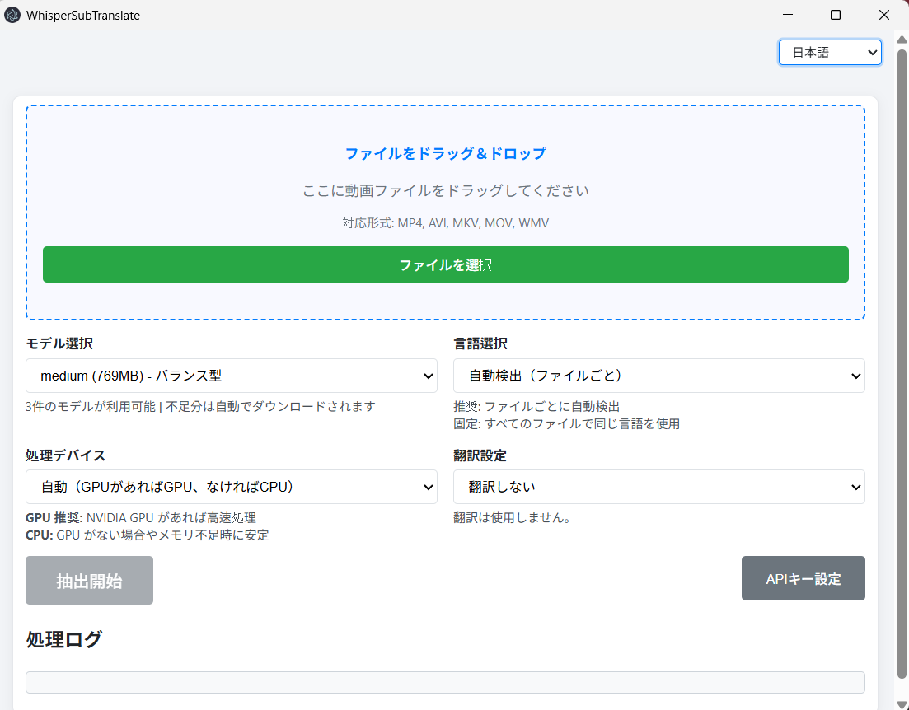

# WhisperSubTranslate

[English](./README.md) | [한국어](./README.ko.md) | 日本語 | [中文](./README.zh.md)

動画の音声を文字起こし（SRT）し、希望の言語に翻訳する Windows デスクトップアプリ。抽出は Faster‑Whisper 実行ファイルで安定稼働し、翻訳は MyMemory（無料）/DeepL/ChatGPT（OpenAI）を選択できます。

> 重要: 本アプリは Whisper（Faster‑Whisper）で動画の音声から新規に SRT 字幕を生成します。既存の埋め込み字幕トラックや画面上の文字（OCR）を抽出するツールではありません。

## プレビュー



## なぜ WhisperSubTranslate なのか

処理はすべてローカル。動画はPCの外へ出ません。アカウントもクレジットカードも不要。精度の高いSRTをオフラインで作成し、必要なときだけ翻訳（無料MyMemory もしくは自分の DeepL/OpenAI キー）を使えます。

### 価値の要点

| 課題 | 得られる価値 |
| --- | --- |
| プライバシーと制御 | 100%ローカルSTT、クラウドアップロードなし |
| ゼロサインアップ | アカウント/カード/個人情報 不要 |
| 利用制限なし | アプリ側の日/月制限なし |
| 外国語動画の理解 | 抽出+翻訳 SRT を一度に生成 |
| セットアップの手間 | モデル自動DL、Python不要 |
| フィードバック | キュー、滑らかな進捗、ETA |

> 注意：オンライン翻訳エンジン利用時は提供者側クォータ（例：MyMemory）が適用される場合があります。アプリ自体は上限を設けません。

## はじめに

### 開発者: ローカルで実行

事前準備（初回のみ、抽出に必須）

1) Purfview のリリースから `Faster-Whisper-XXL_r245.4_windows.7z` をダウンロード: https://github.com/Purfview/whisper-standalone-win/releases/tag/Faster-Whisper-XXL
2) `.bat` を除外してプロジェクトルート（`main.js` と同じ場所）へ展開。例（7‑Zip）:
```powershell
7z x Faster-Whisper-XXL_r245.4_windows.7z -x!*.bat -o.
```

その後、実行:
```bash
npm install
npm start
```
初回は、モデルが無ければ `_models/` に自動ダウンロードします。

### 一般ユーザー: 配布（ポータブル）で実行

- Releases から最新のポータブルアーカイブ：`WhisperSubTranslate v1.0.0.7z`
- 展開後のフォルダで `WhisperSubTranslate.exe` を実行

### Windows 用ビルド
```bash
npm run build-win
```
成果物は `dist/` に出力されます。

## 技術スタック

[](https://www.electronjs.org/) [](https://nodejs.org/) [](https://developer.mozilla.org/docs/Web/JavaScript) [](https://www.deepl.com/ja/pro-api) [](https://platform.openai.com/)

| 項目 | 詳細 |
| --- | --- |
| ランタイム | Electron, Node.js, JavaScript |
| パッケージング | electron‑builder |
| ネットワーク | axios |
| 音声→テキスト | Faster‑Whisper 実行ファイル |
| 翻訳（任意） | DeepL API, OpenAI（ChatGPT）, MyMemory |

## 翻訳エンジン

| エンジン | コスト | API キー | 制限 / 備考 |
| --- | --- | --- | --- |
| MyMemory | 無料 | 不要 | 1 IP あたり約 5万/日 |
| DeepL | 月 50万無料 | 必要 | 有料プランあり |
| ChatGPT（OpenAI） | 有料 | 必要 | 従量課金 |

API キー/設定は `app.getPath('userData')` 配下の `translation-config.json` に保存され、Git/配布物には含まれません。

## 開発者向けセットアップ（ローカル実行/ビルド）

この内容は「はじめに」に統合しました。上の事前準備をご参照ください。

## ブランチ（シンプル Trunk）

Trunk-based development：単一の `main` を幹として保ち、短命ブランチで作業して PR で素早くマージします。

| ブランチ | 目的 | ルール |
| --- | --- | --- |
| main | 常にリリース可能 | `v1.0.0` などタグ付け |
| feature/* | 小さく集中した作業 | `main` から分岐し、PR で `main` にマージ |

## コントリビュート

### 1) ブランチ/命名

あらゆる変更（機能／修正／文書）は 1 種類に統一します。

| パターン | 用途 |
| --- | --- |
| `feature/<scope>-<desc>` | すべての変更 |

推奨する <scope> 例：i18n, ui, translation, whisper, model, download, queue, progress, ipc, main, renderer, updater, config, build, logging, perf, docs, readme

例：
```text
feature/i18n-api-modal
feature/ui-progress-smoothing
feature/translation-deepl-test
feature/main-disable-devtools
```

### 2) コミット規約（Conventional Commits）
`feat:`, `fix:`, `docs:`, `refactor:`, `chore:`, `perf:`, `build:` を使用します。

```text
feat: add DeepL connection test
fix: localize target language note
```

### 3) コード方針（I18N）

| トピック | ガイドライン |
| --- | --- |
| I18N | UI/ログ文字列をコードに直書きせず、I18N テーブルのキー参照で使用 |
| UX | 進捗/ETA/キューの一貫性維持、リグレッション防止 |
| スコープ | 小さな変更単位、明確な関数名 |
| 多言語 UI | UI 追加時は ko/en/ja/zh を同時更新 |

### 4) 手動テスト・チェックリスト

| シナリオ | 確認事項 |
| --- | --- |
| 抽出のみ | 開始/停止、進捗/ETA の挙動 |
| 抽出+翻訳 | E2E 結果と最終 SRT 名称 |
| モデルダウンロード | 未所持時の自動 DL、途中キャンセル/停止 |
| I18N 切替 | 対象言語ラベル/モーダル文言が即時更新 |
| 翻訳エンジン | MyMemory（無キー）、DeepL/OpenAI（キー有り） |
| ビルド | `npm run build-win` 完了 |

### 5) PR チェックリスト

| 項目 | 期待 |
| --- | --- |
| 説明 | 変更内容を明確に記載 |
| UI 影響 | 視覚的変更のスクリーンショット |
| テスト | 再現/検証手順 |
| アセット | 大容量バイナリ禁止、スクショは `docs/` |

## 支援

このプロジェクトが時間短縮やより良い字幕作成に役立つなら、支援は開発スピードを直接高めます。
- 使途：バグ修正、モデルDLの安定化、UI磨き、翻訳オプション拡充、Windowsビルド/テスト
- 透明性：データ販売なし。支援金は開発時間、リリース用インフラ、翻訳APIテスト費用にのみ使用します。
- 一度の支援でも README/リリースノートのスポンサー欄にお名前を掲載（非公開希望可）。
- 月額支援（$3/mo, GitHub Sponsors自動課金）は “Sponsor Request” イシューの優先トリアージ（ベストエフォート）を追加特典として付与。

[](https://github.com/sponsors/Blue-B) [](https://buymeacoffee.com/beckycode7h)

## 謝辞

- Faster‑Whisper スタンドアロン実行ファイルの提供に感謝します： [Purfview/whisper-standalone-win](https://github.com/Purfview/whisper-standalone-win)

## ライセンス

ISC。外部サービス（DeepL, OpenAI など）の規約に従ってください。 