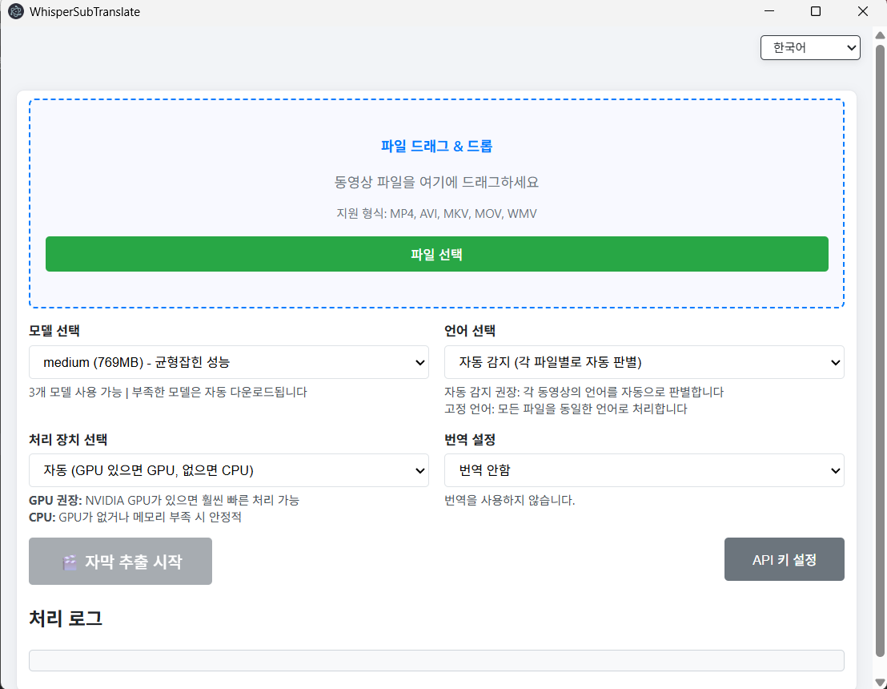

# WhisperSubTranslate

[English](./README.md) | 한국어 | [日本語](./README.ja.md) | [中文](./README.zh.md)

로컬에서 동영상의 음성을 인식해 SRT 자막을 만들고, 원하는 언어로 번역하는 Windows 데스크톱 앱입니다. 추출은 whisper.cpp로 빠르고 안정적으로 처리되며, 번역은 MyMemory(무료), DeepL, GPT-5-nano(OpenAI)를 선택할 수 있습니다.

> 중요: 이 앱은 동영상의 소리를 whisper.cpp로 인식해 새로운 SRT 자막을 생성합니다. 기존에 내장된 자막 트랙이나 화면에 그려진 자막(OCR)은 추출하지 않습니다.

## 미리보기



## 왜 WhisperSubTranslate를 써야 할까요?

자막 추출은 100% 로컬에서 이루어집니다. 영상은 내 PC 밖으로 나가지 않습니다. 계정도 카드도 필요 없습니다. 정확한 SRT를 오프라인으로 만들고, 번역은 인터넷 연결 필요 (무료 MyMemory 또는 내 DeepL/OpenAI 키).

### 핵심 가치 한눈에

| 고민 | 제공 가치 |
| --- | --- |
| 프라이버시/통제 | 100% 로컬 STT, 클라우드 업로드 없음 |
| 가입/결제 불필요 | 계정/카드/개인정보 입력 없이 사용 |
| 사용 제한 없음 | 앱 차원의 일/월 사용량 제한 없음 |
| 외국어 영상 이해 | 추출+번역 SRT를 한 번에 생성 |
| 설치/환경 부담 | 모델 자동 다운로드, 파이썬 불필요 |
| 진행률/피드백 | 대기열, 매끄러운 진행률, ETA |

> 참고: 온라인 번역 엔진을 사용할 경우, 제공사(MyMemory 등)의 정책/쿼터는 적용될 수 있습니다. 앱 자체는 별도의 사용 제한을 두지 않습니다.

## 시작하기

### 사용자: 포터블 배포판 실행

- Releases에서 최신 포터블 압축 파일 다운로드: `WhisperSubTranslate-v1.3.0-portable.zip`
- 압축 해제한 폴더에서 `WhisperSubTranslate.exe` 실행

바로 사용 가능합니다. 추출은 PC에서 완전 오프라인으로 실행됩니다. 번역은 선택 사항(무료 MyMemory 기본 제공, DeepL/OpenAI는 본인 API 키 필요).

### 개발자: 소스에서 실행

```bash
npm install
npm start
```
- **whisper-cpp**는 `npm install` 시 자동 다운로드됩니다 (~700MB CUDA 버전)
- **FFmpeg**는 npm 패키지를 통해 자동 포함됩니다
- 첫 실행 시 선택한 GGML 모델이 없으면 `_models/`에 자동 다운로드됩니다

> 자동 다운로드 실패 시, [whisper.cpp releases](https://github.com/ggml-org/whisper.cpp/releases)에서 수동 다운로드 후 `whisper-cpp/` 폴더에 압축 해제하세요.

### Windows 빌드
```bash
npm run build-win
```
산출물은 `dist2/`에 생성됩니다.

## 기술 스택

[](https://www.electronjs.org/) [](https://nodejs.org/) [](https://developer.mozilla.org/docs/Web/JavaScript) [](https://www.deepl.com/ko/pro-api) [](https://platform.openai.com/)

| 영역 | 설명 |
| --- | --- |
| 런타임 | Electron, Node.js, JavaScript |
| 패키징 | electron-builder |
| 네트워킹 | axios |
| 음성→텍스트 | whisper.cpp (GGML 모델) |
| 번역(선택) | DeepL API, OpenAI(GPT-5-nano), MyMemory |

## 번역 엔진

| 엔진 | 비용 | 키 | 제한 / 비고 |
| --- | --- | --- | --- |
| MyMemory | 무료 | 불필요 | IP당 일 약 5만자 |
| DeepL | 월 50만자 무료 | 필요 | 유료 플랜 제공 |
| GPT-5-nano(OpenAI) | 유료 | 필요 | 매우 저렴 ($0.05/1M 입력) |

API 키와 설정은 사용자 PC의 `app.getPath('userData')` 경로에 기본 인코딩을 적용하여 저장됩니다. 파일 탐색기에서 우연히 열어도 평문으로 노출되지 않도록 보호하며, Git이나 배포 파일에는 절대 포함되지 않습니다.

## 언어 지원

### UI 언어
한국어, 영어, 일본어, 중국어 (4개 언어)

### 번역 대상 언어 (12개)
한국어 (ko), 영어 (en), 일본어 (ja), 중국어 (zh), 스페인어 (es), 프랑스어 (fr), 독일어 (de), 이탈리아어 (it), 포르투갈어 (pt), 러시아어 (ru), **헝가리어 (hu)**, **아랍어 (ar)**

### 음성 인식 언어
whisper.cpp는 100개 이상의 언어를 지원합니다 (영어, 스페인어, 프랑스어, 독일어, 이탈리아어, 포르투갈어, 러시아어, 중국어, 일본어, 한국어, 아랍어, 힌디어, 터키어 등 주요 세계 언어 포함).

## 모델과 성능

모델은 `_models/`에 저장되고 필요 시 자동 다운로드됩니다. 큰 모델일수록 느리지만 더 정확할 수 있습니다. CUDA 가능 시 GPU, 아니면 CPU로 동작합니다.

| 모델 | 크기 | VRAM | 속도 | 품질 |
| --- | --- | --- | --- | --- |
| tiny | ~75MB | ~1GB | 가장 빠름 | 기본 |
| base | ~142MB | ~1GB | 빠름 | 좋음 |
| small | ~466MB | ~2GB | 보통 | 더 좋음 |
| medium | ~1.5GB | ~4GB | 느림 | 훌륭함 |
| large-v3 | ~3GB | ~5GB | 가장 느림 | 최고 |
| large-v3-turbo ⭐ | ~809MB | ~4GB | 빠름 | 뛰어남 |

> 참고: VRAM 요구사항은 [whisper.cpp](https://github.com/ggerganov/whisper.cpp)의 GGML 최적화 기준이며, PyTorch Whisper(large ~10GB)보다 훨씬 낮습니다. 테스트: 6GB VRAM GPU에서 large-v3 동작 확인.

## 브랜치(단순 Trunk)

Trunk 기반 개발: `main`을 단일 기준(트렁크)으로 두고, 짧은 생명의 분기에서 작업한 뒤 PR로 빠르게 머지합니다.

| 브랜치 | 목적 | 규칙 |
| --- | --- | --- |
| main | 항상 배포 가능 | 예: `v1.0.0`으로 태깅 |
| feature/* | 작은 단위 작업 | `main`에서 분기, PR로 `main`에 머지 |

## 기여

### 1) 브랜치/네이밍

모든 변경(기능/수정/문서)은 하나의 타입으로 통일합니다.

| 패턴 | 용도 |
| --- | --- |
| `feature/<scope>-<설명>` | 모든 변경 |

권장 <scope> 예시: i18n, ui, translation, whisper, model, download, queue, progress, ipc, main, renderer, updater, config, build, logging, perf, docs, readme

예시:
```text
feature/i18n-api-modal
feature/ui-progress-smoothing
feature/translation-deepl-test
feature/main-disable-devtools
```

### 2) 커밋 규칙(Conventional Commits)
`feat:`, `fix:`, `docs:`, `refactor:`, `chore:`, `perf:`, `build:` 접두어를 사용하세요.

```text
feat: add DeepL connection test
fix: localize target language note
```

### 3) 코드 가이드(I18N)

| 주제 | 가이드 |
| --- | --- |
| I18N | UI/로그 문자열을 코드에 직접 쓰지 말고 I18N 테이블 키로 참조 |
| UX | 진행률/ETA/대기열 동작 일관성 유지, 회귀 방지 |
| 범위 | 작은 단위의 집중된 변경, 명확한 함수명 |
| 다국어 UI | UI 추가 시 ko/en/ja/zh 함께 업데이트 |

### 4) 수동 테스트 체크리스트

| 시나리오 | 검증 항목 |
| --- | --- |
| 추출만 | 시작/중지, 진행률/ETA 동작 |
| 추출+번역 | 종단 결과와 최종 SRT 파일명 |
| 모델 다운로드 | 누락 모델 자동 다운로드, 중간 취소/정지 |
| I18N 전환 | 대상 언어 라벨/모달 텍스트가 즉시 갱신 |
| 번역 엔진 | MyMemory(무키), DeepL/OpenAI(키) |
| 빌드 | `npm run build-win` 완료 |

### 5) PR 체크리스트

| 항목 | 기대 사항 |
| --- | --- |
| 설명 | 변경 사항을 명확히 기술 |
| UI 영향 | 시각적 변경 스크린샷 첨부 |
| 테스트 | 재현/검증 절차 제공 |
| 자산 | 대용량 바이너리 금지, 스크린샷은 `docs/` |

## 후원

이 프로젝트가 시간을 아껴주거나 더 나은 자막을 만드는 데 도움이 된다면, 후원은 개발 속도를 직접 높여줍니다.
- 사용처: 버그 수정, 모델 다운로드 안정화, UI 다듬기, 번역 옵션 확장, Windows 빌드/테스트
- 투명성: 데이터 판매 없음. 후원금은 개발 시간, 릴리스 빌드 인프라, 번역 API 테스트 비용에만 사용합니다.
- 일시 후원도 스폰서 명단(README/릴리스 노트)에 이름을 표기합니다(비공개 요청 가능).
- 월 정기 후원($3/mo, GitHub Sponsors 자동결제)은 "Sponsor Request" 이슈 우선 확인(베스트 에포트) 혜택을 추가로 제공합니다.

[](https://github.com/sponsors/Blue-B) [](https://buymeacoffee.com/beckycode7h)

## 감사의 말

- whisper.cpp는 Georgi Gerganov가 개발했습니다: [ggml-org/whisper.cpp](https://github.com/ggml-org/whisper.cpp)
- FFmpeg: [ffmpeg.org](https://ffmpeg.org/)

## 라이선스

ISC. 외부 API/서비스(DeepL, OpenAI 등)는 각 약관을 준수해야 합니다.
