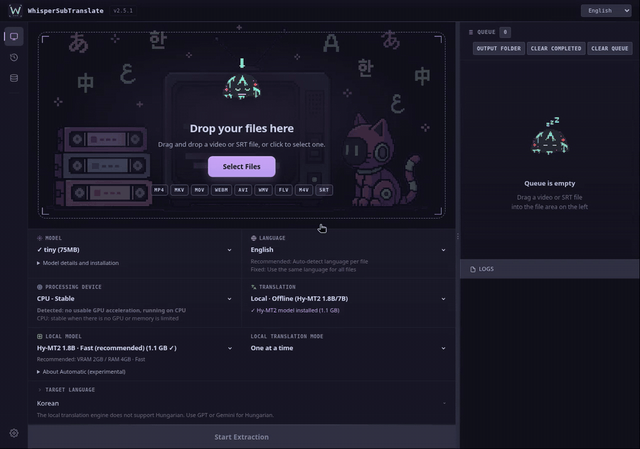
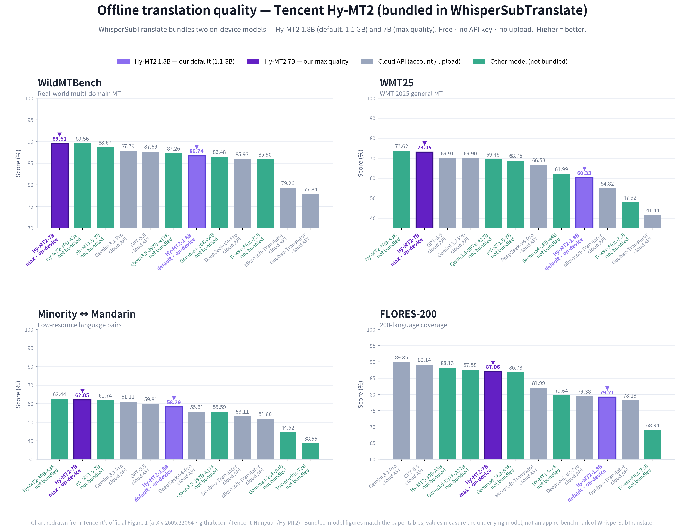

# WhisperSubTranslate

English | [한국어](./docs/README.ko.md) | [日本語](./docs/README.ja.md) | [中文](./docs/README.zh.md) | [Polski](./docs/README.pl.md)

Turn any video into multilingual subtitles, locally. Drop in a video, generate an SRT with whisper.cpp, then translate it offline with a downloaded Hy-MT2 model or with free/paid online engines.

> This app creates new subtitles from your video's audio (speech to text). It does not extract embedded subtitle tracks or read on-screen text (no OCR).

## Preview

[](assets/demo/demo-30s.mp4)

[Watch/download the 30-second MP4](assets/demo/demo-30s.mp4). English UI, real video-to-subtitle extraction and local translation. [Recording notes](docs/DEMO_RECORDING.md).

<details>
<summary>Static app screenshot</summary>


</details>

## Features

- 100% local speech to text. Your video never leaves your machine, no account, no upload.
- Offline translation with Hy-MT2 after the initial model download, or online engines (MyMemory, DeepL, OpenAI, Gemini, Claude) with your own keys.
- Automatic model download. No Python, no manual setup.
- Sync repair models (large-v2 Sync and Sync Lite) for videos where normal models drift out of sync.
- Queue, live progress, and local-only job history.

## Getting started

### Users

**[Download Windows x64 ZIP · v2.5.1 · 2.15 GB](https://github.com/Blue-B/WhisperSubTranslate/releases/download/v2.5.1/WhisperSubTranslate-v2.5.1-win-x64.zip)** · [Release notes / newer versions](https://github.com/Blue-B/WhisperSubTranslate/releases/latest)

Choose `WhisperSubTranslate-v2.5.1-win-x64.zip`, not GitHub's “Source code” archives. No Python or separate CUDA Toolkit installation is needed for this Windows package. Linux users should follow the source setup below.

1. Extract the **entire ZIP into a new folder**, then run `WhisperSubTranslate.exe` inside it. Do not run the EXE from inside the ZIP or move it away from its bundled files.
2. For a first check, add a short video (about 10–30 seconds) with clear speech. Keep **Translation → No translation**, choose the spoken language (or Automatic), and leave **Device → Automatic**. The default speech model is `large-v3-turbo`; `tiny`/`base` use less download space for a quick setup check, with lower accuracy.
3. Click **Start Extraction**. Confirm the selected model download if prompted and keep the internet connected until it finishes. Model download happens once; it is separate from transcription time.
4. When the job completes, use **Open output folder** to find the `.srt`. By default it is saved beside the source video; existing files are saved under a new name. Check a few lines and their timing in your video player.
5. To translate, select **Hy-MT2 (local)** and a target language, then start again (or add an existing SRT). The selected translation model downloads separately on first use. After the required models are downloaded, local extraction and local translation work offline without an API key.

#### Download size and disk space

The Windows ZIP and AI models are **separate downloads**. Approximate decimal sizes for v2.5.1:

| What you download | Additional download | When needed |
| --- | ---: | --- |
| Windows x64 portable ZIP | 2.15 GB | Once per app version |
| `large-v3-turbo` speech model (default) | 1.62 GB | First extraction with this model |
| `tiny` / `base` speech model | 77.7 MB / 148 MB | Optional smaller setup check |
| Hy-MT2 1.8B translation model | 1.13 GB | Only for local translation |
| Hy-MT2 7B translation model | 6.16 GB | Optional larger local translator |

ZIP + default speech model is about **3.77 GB of network downloads**; adding Hy-MT2 1.8B makes it about **4.90 GB**. These are not free-disk-space requirements: extraction needs space for both the ZIP and unpacked app, and processing also needs temporary audio, output and download headroom. The unpacked Windows app size is not measured here, so no exact total disk requirement is claimed. Sync models need additional engine/model downloads; see [Speech recognition models](#speech-recognition-models).

Models normally live on the system drive under `%APPDATA%\whispersubtranslate`, even when the EXE is on another drive. For a self-contained installation, create `portable-data` next to the EXE **before first launch**; see [Portable data layout](#portable-data-layout).

If the first job seems stuck, distinguish **model downloading**, **speech extraction**, and **translation** in the log. For unexpectedly slow local translation, check the actual backend shown in the log, then use **Settings → Copy diagnostics**. Speech recognition and translation choose their backends separately; owning an NVIDIA GPU does not prove a translation job used CUDA.

### Developers

```bash
npm ci
npm start
```

- Node.js >= 22.12.0 (see `engines` in `package.json`); use the committed lockfile
- Dependency installation also provisions whisper.cpp (CUDA and Vulkan builds on Windows); allow several GB of disk space
- FFmpeg is included via npm; the selected GGML model downloads on first use

Application code is organized under `src/main/` (Electron main process and services), `src/preload/` (renderer bridge), `src/renderer/` (UI), and `src/shared/` (shared IPC channels).

### Linux

```bash
sudo apt install cmake build-essential git ffmpeg   # Ubuntu/Debian
npm ci   # whisper.cpp is built from source
npm start
```

For CUDA acceleration, install the NVIDIA CUDA Toolkit before `npm ci`. Manual whisper.cpp build steps are in [CONTRIBUTING.md](CONTRIBUTING.md).

- **Linux keyring**: API keys are stored via Electron safeStorage (libsecret). Without a keyring daemon (headless SSH session, minimal desktop/WM), saving falls back to legacy AES with a hardcoded key: the app logs an explicit security warning and marks the save as `insecure`. That storage is **not secure** - install `gnome-keyring` (or run in a desktop session with a keyring) to enable secure storage.

### Build (Windows)

```bash
npm run build-win -- --publish never   # artifacts are emitted to dist2/
```

Build on Windows for normal Windows dependency installation. When cross-building from Linux, npm may omit Windows-only optional packages. The build workspace must include the lockfile-pinned `@node-llama-cpp/win-x64`, `win-x64-cuda`, `win-x64-cuda-ext`, and `win-x64-vulkan` packages, including their JS/JSON metadata and native binaries. A successful build alone does not verify that local translation can load its backend on Windows.

## Translation engines

Download a Tencent Hy-MT2 model once to translate subtitles offline, or use free/paid online engines (API keys required where applicable).

| Engine                             | Offline | API key | Cost            | Notes                                                                                        |
| ---------------------------------- | :-----: | :-----: | --------------- | -------------------------------------------------------------------------------------------- |
| Hy-MT2 1.8B (local, default)       |   Yes   |   No    | Free            | ~1.13GB, VRAM 2GB / RAM 4GB, on-device                                                       |
| Hy-MT2 7B (local)                  |   Yes   |   No    | Free            | ~6.16GB, VRAM 8GB / RAM 12GB, larger model                                                   |
| MyMemory                           |   No    |   No    | Free            | Daily limits apply                                                                           |
| DeepL                              |   No    |   Yes   | Varies by plan  | Check your account's current API limits                                                      |
| OpenAI (configurable model)        |   No    |   Yes   | Paid            | Select or enter a model in Settings                                                          |
| Gemini (configurable model)        |   No    |   Yes   | Varies by model | Account limits apply ([get key](https://aistudio.google.com/app/apikey))                     |
| Claude (configurable model)        |   No    |   Yes   | Paid            | Select or enter a model in Settings ([get key](https://console.anthropic.com/settings/keys)) |
| Custom OpenAI-compatible providers |   No    |   Yes   | Varies          | Bring your own endpoint (OpenRouter, Ollama, vLLM, …)                                        |

Local Hy-MT2 translation needs no API key or network connection after the model download, and has no per-use cost. Subtitle text stays on your machine when using this engine.

Hy-MT2 downloads use pinned model revisions and are checked against exact file sizes and SHA-256 digests before installation. Existing models are also hash-checked before loading, with successful checks cached for unchanged files during the app session. A failed integrity check does not delete an existing model.

Local translation selects its GPU backend automatically; NVIDIA hardware can use Vulkan as well as CUDA, depending on backend availability. This selection is separate from whisper.cpp speech recognition. CPU mode is also available.

**One at a time** is the default and can still use the GPU. **Automatic** is an opt-in experimental mode that adjusts parallel translation when the model is fully loaded on CUDA and memory permits. It can be slower, especially on short jobs. If problems occur, select One at a time. Recoverable parallel setup or memory failures announce a one-at-a-time retry on the same GPU and record the original cause in `errors.log`; this is separate from device-auto CPU fallback and does not guarantee success.

### Translation quality (offline engine)

WhisperSubTranslate supports downloading Tencent's Hy-MT2 models (1.8B default, 7B optional). Tencent's official evaluation shows the Hy-MT2 family competing with leading commercial translation APIs, and ahead of several of them on some benchmarks.



Source: official benchmarks from Tencent: [Hy-MT2 repository](https://github.com/Tencent-Hunyuan/Hy-MT2), [technical report](https://arxiv.org/pdf/2605.22064), [models on HuggingFace](https://huggingface.co/tencent/Hy-MT2-1.8B). The chart is redrawn from Tencent's official Figure 1, with supported-model (1.8B/7B) numbers checked against the paper tables. These figures measure the underlying model on standard machine translation benchmarks (WildMTBench, WMT25, FLORES-200, etc.), not a WhisperSubTranslate-specific benchmark.

For long videos (1hr+), MyMemory's daily limit can cause slowdowns. Use Gemini, DeepL, or a configured GPT model instead.

## Speech recognition models

Models download on demand into `_models/`. NVIDIA GPUs use CUDA, other Vulkan-capable GPUs (AMD, Intel) use Vulkan, and CPU is the fallback. Pick a size that fits your GPU.

| Model                    | Size    | VRAM   | Speed   | Notes                                |
| ------------------------ | ------- | ------ | ------- | ------------------------------------ |
| tiny                     | ~75MB   | ~1GB   | Fastest | Basic                                |
| base                     | ~142MB  | ~1GB   | Fast    | Good                                 |
| small                    | ~466MB  | ~1GB   | Medium  | Better                               |
| medium                   | ~1.5GB  | ~2GB   | Medium  | Great                                |
| large-v3                 | ~3GB    | ~4GB   | Slow    | Best transcription                   |
| large-v3-turbo (default) | ~1.62GB | ~2GB   | Fast    | Best all-round                       |
| large-v2 Sync            | ~4.4GB  | ~4.5GB | Slow    | Separate engine; fixes subtitle sync |
| large-v2 Sync Lite       | shared  | ~3GB   | Slow    | Same file as Sync, int8, lower VRAM  |

Sync and Sync Lite use a separate Faster-Whisper engine (auto-downloaded once; engine archive ~1.4GB, model file ~3GB, ~4.4GB combined) and share the same model file, so one download covers both. Use them only when normal models drift out of sync; they are most accurate on non-English video (Japanese, Korean, Chinese). English is usually fine with large-v3-turbo.

Sizes and memory requirements are approximate. Actual RAM/VRAM use depends on the backend, model and settings; download size is not runtime memory usage.

## Language support

- UI: Korean, English, Japanese, Chinese, Polish
- Translation targets (15): ko, en, ja, zh, es, fr, de, it, pt, ru, hu, ar, pl, tr, fa
- Audio recognition: 100+ languages via whisper.cpp

## Data storage

Settings, model files, logs and history are stored locally. Online translation sends subtitle text to the selected service; local Hy-MT2 translation does not.

| Data                | Location                                                                                                                                          |
| ------------------- | ------------------------------------------------------------------------------------------------------------------------------------------------- |
| Settings & API keys | `%APPDATA%\whispersubtranslate\translation-config-safe.json`                                                                                      |
| Job history         | `%APPDATA%\whispersubtranslate\history.json` (up to 200 entries)                                                                                  |
| Error logs          | `%APPDATA%\whispersubtranslate\logs\errors.log`                                                                                                   |
| Models              | `%APPDATA%\whispersubtranslate\_models` (user data folder; non-ASCII Windows accounts fall back to `C:\Users\Public\WhisperSubTranslate\_models`) |

Local translation models are stored in `%APPDATA%\whispersubtranslate\hy-mt-models`. The paths above are Windows defaults; portable mode redirects the user data folder.

In Settings, **Copy diagnostics** omits API keys, paths and subtitle text. **Show error log in folder** reveals the actual log location, including portable mode. If no error log exists, it opens the folder without creating an empty log. Review raw logs for private paths or content before sharing them.

API keys use OS-level safe storage where available (see the Linux keyring warning above), and the config must never be committed or bundled. Job history is optional (toggle in Settings) and capped at 200 entries.

### Portable data layout

By default models, caches, and settings live under `%APPDATA%` (system SSD). To keep everything on a USB stick / external drive, create a `portable-data/` folder next to the executable (or set the `WHISPER_PORTABLE_DATA` environment variable to a folder path) — the app then redirects its `userData` there.

## Contributing

Pull requests are welcome. See [CONTRIBUTING.md](CONTRIBUTING.md) for branch
naming, commit style, the manual test checklist, and the manual whisper.cpp
build. To add a UI language or translation target, see the
[Translation Guide](docs/TRANSLATION.md).

Help translate the app UI on
[Weblate](https://hosted.weblate.org/engage/whispersubtranslate/); translatable
UI strings live in [`locales/*.json`](locales/).

<a href="https://hosted.weblate.org/engage/whispersubtranslate/">
  
</a>

## Contributors

Thanks to everyone who helps make WhisperSubTranslate better.

<a href="https://github.com/Blue-B"></a>
<a href="https://github.com/matbgn"></a>
<a href="https://github.com/AtillaTahak"></a>

## Support

If this project saves you time, supporting it directly helps with bug fixes, model reliability, and new translation options.

[](https://github.com/sponsors/Blue-B) [](https://buymeacoffee.com/beckycode7h) [](https://www.paypal.com/ncp/payment/ZEWFKDX595ESJ)

## Acknowledgments

- whisper.cpp by Georgi Gerganov: [ggml-org/whisper.cpp](https://github.com/ggml-org/whisper.cpp)
- Hy-MT2 by Tencent: [Tencent-Hunyuan/Hy-MT2](https://github.com/Tencent-Hunyuan/Hy-MT2)
- FFmpeg: [ffmpeg.org](https://ffmpeg.org/)
- Faster-Whisper-XXL: [Purfview/whisper-standalone-win](https://github.com/Purfview/whisper-standalone-win)
- Silero VAD, `deepl-node`, `node-llama-cpp`, `axios`, and other npm dependencies

See [THIRD_PARTY_NOTICES.md](THIRD_PARTY_NOTICES.md) for the full list of bundled/downloaded components and their licenses.

## License

GPL-3.0. External APIs and services (DeepL, OpenAI, Gemini, etc.) require compliance with their own terms.
