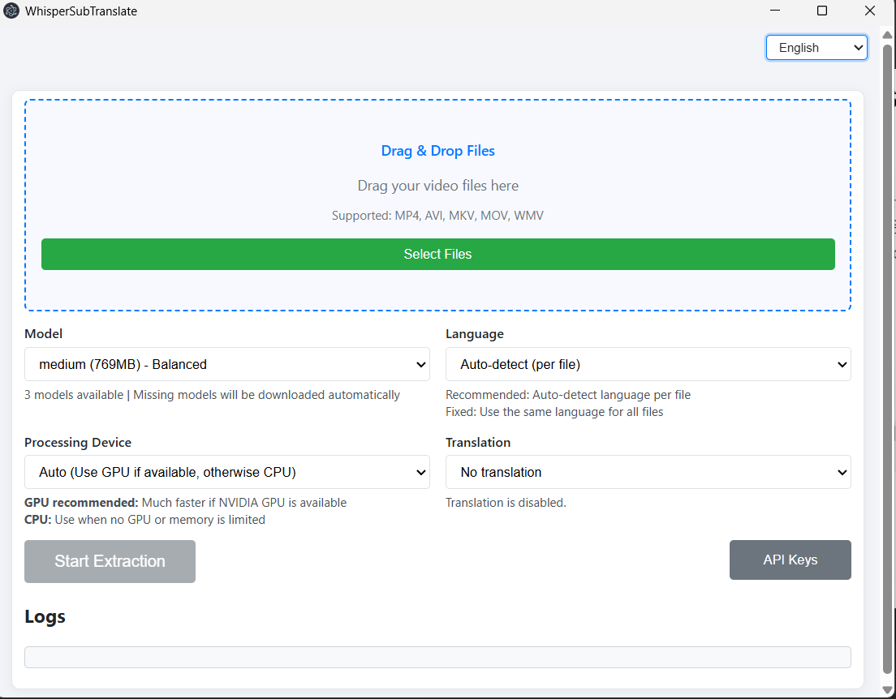

# WhisperSubTranslate

[English](./README.md) | [한국어](./README.ko.md) | [日本語](./README.ja.md) | [中文](./README.zh.md) | Polski

Szybka, lokalna aplikacja desktopowa do konwersji wideo na napisy (SRT) i tłumaczenia ich na wybrany język. Wykorzystuje whisper.cpp do ekstrakcji oraz opcjonalne silniki online do tłumaczenia.

> Ważne: Ta aplikacja tworzy nowe napisy SRT z dźwięku wideo za pomocą whisper.cpp. Nie wyodrębnia istniejących osadzonych ścieżek napisów ani tekstu na ekranie (brak OCR).

## Podgląd



## Dlaczego WhisperSubTranslate

Ekstrakcja napisów działa w 100% lokalnie — Twoje wideo nigdy nie opuszcza Twojego komputera. Brak przesyłania do chmury, brak kont, brak kart kredytowych. Twórz dokładne pliki SRT offline; tłumaczenie wymaga połączenia internetowego (darmowy MyMemory lub własne klucze API DeepL/OpenAI).

### Wartość w skrócie

| Potrzeba | Co otrzymujesz |
| --- | --- |
| Prywatność i kontrola | 100% lokalne STT; bez przesyłania do chmury |
| Zero rejestracji | Bez konta, karty kredytowej, danych osobowych |
| Nieograniczone użycie | Brak dziennych/miesięcznych limitów aplikacji |
| Zrozumienie obcych filmów | Ekstrakcja + tłumaczenie SRT za jednym razem |
| Unikanie problemów z instalacją | Auto-pobieranie modeli; bez Pythona |
| Przejrzysty feedback | Kolejka, płynny postęp, ETA |

> Uwaga: Podczas korzystania z silników tłumaczenia online mogą obowiązywać limity dostawcy (np. kwota MyMemory). Sama aplikacja nie nakłada ograniczeń użytkowania.

## Rozpoczęcie pracy

### Dla użytkowników: uruchom wersję przenośną

## Szybki start (Przenośna)

- Pobierz najnowsze archiwum przenośne z Releases: `WhisperSubTranslate-v1.3.0-win-x64.zip`
- Otwórz rozpakowany folder i uruchom `WhisperSubTranslate.exe`

To wszystko — ekstrakcja działa w pełni offline na Twoim PC. Tłumaczenie jest opcjonalne (darmowy MyMemory jest wbudowany; DeepL/OpenAI wymagają własnych kluczy API).

### Dla deweloperów: uruchom ze źródła

```bash
npm install
npm start
```
- **whisper-cpp** jest automatycznie pobierany podczas `npm install` (~700MB wersja CUDA)
- **FFmpeg** jest automatycznie dołączony przez pakiet npm
- Przy pierwszym uruchomieniu wybrany model GGML zostanie pobrany do `_models/` jeśli brakuje

> Jeśli automatyczne pobieranie nie powiedzie się, pobierz ręcznie z [whisper.cpp releases](https://github.com/ggml-org/whisper.cpp/releases) i rozpakuj do folderu `whisper-cpp/`.

### Budowanie (Windows)
```bash
npm run build-win
```
Artefakty są generowane do `dist2/`.

## Stack technologiczny

[](https://www.electronjs.org/) [](https://nodejs.org/) [](https://developer.mozilla.org/docs/Web/JavaScript) [](https://www.deepl.com/pro-api) [](https://platform.openai.com/)

| Obszar | Szczegóły |
| --- | --- |
| Runtime | Electron, Node.js, JavaScript |
| Pakowanie | electron-builder |
| Sieć | axios |
| Mowa-na-tekst | whisper.cpp (modele GGML) |
| Tłumaczenie (opcjonalne) | DeepL API, OpenAI (GPT-5-nano), Gemini, MyMemory |

## Silniki tłumaczenia

| Silnik | Koszt | Klucz API | Limity / Uwagi |
| --- | --- | --- | --- |
| MyMemory | Darmowy | Nie | ~50K znaków/dzień na IP |
| DeepL | Darmowe 500K/miesiąc | Tak | Dostępne płatne plany |
| GPT-5-nano (OpenAI) | Płatny | Tak | $0.05 wejście / $0.40 wyjście za 1M tokenów |
| Gemini 3 Flash | Darmowy/Płatny | Tak | Darmowy: 250 napisów/dzień (~20-30min), Płatny: bez limitu ([Pobierz klucz](https://aistudio.google.com/app/apikey)) |

Klucze API i preferencje są zapisywane lokalnie na Twoim PC w `app.getPath('userData')` z podstawowym kodowaniem, aby zapobiec przypadkowemu ujawnieniu. Plik konfiguracyjny nigdy nie jest przesyłany do Git ani dołączany do buildów.

## Obsługa języków

### Języki interfejsu
Koreański, Angielski, Japoński, Chiński, Polski (5 języków)

### Języki docelowe tłumaczenia (13)
Koreański (ko), Angielski (en), Japoński (ja), Chiński (zh), Hiszpański (es), Francuski (fr), Niemiecki (de), Włoski (it), Portugalski (pt), Rosyjski (ru), Węgierski (hu), Arabski (ar), **Polski (pl)**

### Języki rozpoznawania audio
whisper.cpp obsługuje ponad 100 języków, w tym wszystkie główne języki świata (angielski, hiszpański, francuski, niemiecki, włoski, portugalski, rosyjski, chiński, japoński, koreański, arabski, hindi, turecki i wiele innych).

## Modele i wydajność

Modele są przechowywane w `_models/` i automatycznie pobierane na żądanie. Wybierz rozmiar odpowiedni dla Twojego komputera; większe modele są wolniejsze, ale mogą być dokładniejsze. CUDA jest używana gdy dostępna; w przeciwnym razie domyślnie CPU.

| Model | Rozmiar | VRAM | Szybkość | Jakość |
| --- | --- | --- | --- | --- |
| tiny | ~75MB | ~1GB | Najszybszy | Podstawowa |
| base | ~142MB | ~1GB | Szybki | Dobra |
| small | ~466MB | ~2GB | Średnia | Lepsza |
| medium | ~1.5GB | ~4GB | Wolna | Świetna |
| large-v3 | ~3GB | ~5GB | Najwolniejsza | Najlepsza |
| large-v3-turbo ⭐ | ~809MB | ~4GB | Szybka | Doskonała |

> Uwaga: Wymagania VRAM dotyczą [whisper.cpp](https://github.com/ggerganov/whisper.cpp) z optymalizacją GGML, która jest znacznie niższa niż PyTorch Whisper (~10GB dla large). Przetestowano: large-v3 działa na GPU z 6GB VRAM.

## Model gałęzi (prosty trunk)

Rozwój oparty na trunk: utrzymuj pojedynczy `main` jako trunk; pracuj w krótkotrwałych gałęziach i szybko scalaj przez PR.

| Gałąź | Cel | Zasada |
| --- | --- | --- |
| main | Zawsze gotowy do wydania | Taguj wydania, np. `v1.0.0` |
| feature/* | Mała, skupiona praca | Gałąź z `main`, scalaj przez PR do `main` |

## Współtworzenie

> **Chcesz dodać nowy język?** Zobacz [Przewodnik tłumaczenia](TRANSLATION.md).

### 1) Gałęzie i nazewnictwo

Używaj jednego typu gałęzi do wszystkiego (funkcje, poprawki, dokumentacja):

| Wzorzec | Użycie |
| --- | --- |
| `feature/<scope>-<krótki-opis>` | Wszystkie zmiany |

Zalecane wartości <scope>: i18n, ui, translation, whisper, model, download, queue, progress, ipc, main, renderer, updater, config, build, logging, perf, docs, readme

Przykłady:
```text
feature/i18n-api-modal
feature/ui-progress-smoothing
feature/translation-deepl-test
feature/main-disable-devtools
```

### 2) Styl commitów (Conventional Commits)
Używaj prefiksów jak `feat:`, `fix:`, `docs:`, `refactor:`, `chore:`, `perf:`, `build:`.

```text
feat: add DeepL connection test
fix: localize target language note
```

### 3) Wytyczne dotyczące kodu

| Temat | Wytyczna |
| --- | --- |
| I18N | Nie wstawiaj stringów UI/logów bezpośrednio. Dodaj je do tabel I18N i odwołuj się przez klucz |
| UX | Utrzymuj spójność stanów postępu/ETA/kolejki; unikaj regresji |
| Zakres | Preferuj małe, skupione zmiany z czytelnymi nazwami funkcji |
| Wielojęzyczny UI | Aktualizuj ko/en/ja/zh/pl razem przy dodawaniu UI |

### 4) Ręczna lista kontrolna testów

| Scenariusz | Weryfikacja |
| --- | --- |
| Tylko ekstrakcja | Przepływy start/stop, zachowanie postępu/ETA |
| Ekstrakcja + tłumaczenie | Wynik end-to-end i finalna nazwa SRT |
| Pobieranie modelu | Brakująca ścieżka modelu; anulowanie/zatrzymanie w trakcie pobierania |
| Przełączanie I18N | Etykieta języka docelowego, teksty modalu API aktualizują się poprawnie |
| Silniki tłumaczenia | MyMemory (bez klucza), DeepL/OpenAI (z kluczami) |
| Budowanie | `npm run build-win` kończy się sukcesem |

### 5) Lista kontrolna Pull Request

| Element | Oczekiwanie |
| --- | --- |
| Opis | Jasne wyjaśnienie zmian |
| Wpływ na UI | Zrzuty ekranu dla zmian wizualnych |
| Testowanie | Kroki do odtworzenia/weryfikacji |
| Zasoby | Brak dużych plików binarnych w Git; zrzuty ekranu w `docs/` |

## Wsparcie

Jeśli ten projekt oszczędza Twój czas lub pomaga publikować lepsze napisy, wsparcie bezpośrednio przyspiesza rozwój:
- Twoje wsparcie pomaga: poprawki błędów, niezawodność pobierania modeli, dopracowanie UI, nowe opcje tłumaczenia i budowanie/testowanie Windows.
- Transparentność: Nie sprzedaję danych; fundusze idą na czas rozwoju, infrastrukturę dla buildów i kredyty testowe dla API tłumaczeń.
- Jednorazowi sponsorzy są wymienieni w README i notatkach wydania (możliwość rezygnacji).
- Miesięczni sponsorzy ($3/mies. przez GitHub Sponsors, automatyczne rozliczanie) otrzymują również priorytetową obsługę zgłoszeń "Sponsor Request" (best-effort).

[](https://github.com/sponsors/Blue-B) [](https://buymeacoffee.com/beckycode7h)

## Podziękowania

- whisper.cpp został opracowany przez Georgi Gerganova: [ggml-org/whisper.cpp](https://github.com/ggml-org/whisper.cpp)
- FFmpeg: [ffmpeg.org](https://ffmpeg.org/)

## Licencja

ISC. Zewnętrzne API/usługi (DeepL, OpenAI itp.) wymagają przestrzegania ich własnych warunków.
