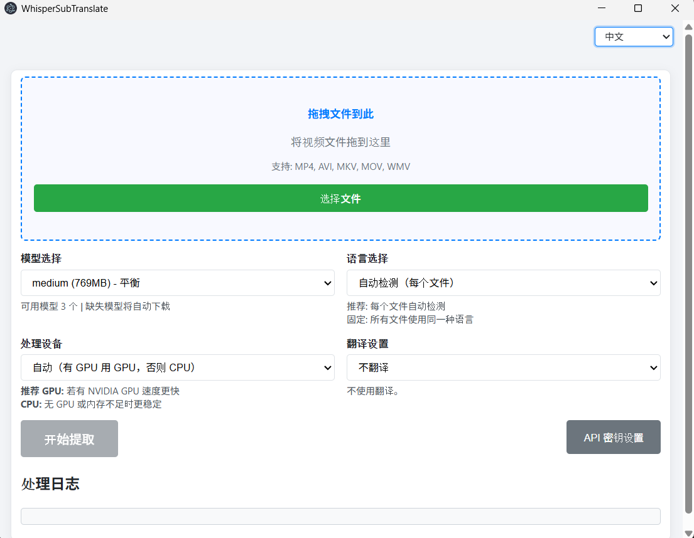

# WhisperSubTranslate

[English](./README.md) | [한국어](./README.ko.md) | [日本語](./README.ja.md) | 中文

将视频音频转成 SRT 字幕，并翻译到目标语言的 Windows 桌面应用。提取使用 Faster‑Whisper 可执行文件，翻译支持 MyMemory（免费）、DeepL、ChatGPT（OpenAI）。

> 重要：本应用使用 Whisper（Faster‑Whisper）从视频音频新生成 SRT 字幕；不会提取已有的内嵌字幕轨道，也不会识别屏幕文字（无 OCR）。

## 预览



## 为什么选择 WhisperSubTranslate

所有处理均在本地完成，视频不会离开你的电脑。无需注册账户，无需信用卡。离线生成高质量 SRT；只在需要时使用翻译（免费 MyMemory，或你自己的 DeepL/OpenAI 密钥）。

### 价值一览

| 需求 | 你得到什么 |
| --- | --- |
| 隐私与掌控 | 100% 本地 STT，无需上传云端 |
| 零门槛 | 无账号、无信用卡、无个人信息 |
| 无使用上限 | 应用本身不设日/月限制 |
| 看懂外语视频 | 一次生成抽取+翻译 SRT |
| 少折腾 | 模型自动下载，无需 Python |
| 清晰反馈 | 队列、平滑进度、ETA |

> 注：使用在线翻译引擎时，服务方可能有配额（如 MyMemory）。应用本身不设置使用上限。

## 快速开始

前置条件（首次一次性，字幕提取必需）

1) 从 Purfview 发布页下载 `Faster-Whisper-XXL_r245.4_windows.7z`：https://github.com/Purfview/whisper-standalone-win/releases/tag/Faster-Whisper-XXL
2) 解压到项目根目录（与 `main.js` 同级），排除 `.bat` 文件。示例（7‑Zip）：
```powershell
7z x Faster-Whisper-XXL_r245.4_windows.7z -x!*.bat -o.
```

然后运行：
```bash
npm install
npm start
```
首次运行如缺少模型，会自动下载至 `_models/`。

### 构建（Windows）
```bash
npm run build-win
```
生成在 `dist/` 目录。

## 开发者环境（本地运行/打包）

该章节已合并到“快速开始”。请参考上面的前置条件步骤。

## 技术栈

[](https://www.electronjs.org/) [](https://nodejs.org/) [](https://developer.mozilla.org/docs/Web/JavaScript) [](https://www.deepl.com/zh/pro-api) [](https://platform.openai.com/)

| 项目 | 说明 |
| --- | --- |
| 运行时 | Electron、Node.js、JavaScript |
| 打包 | electron‑builder |
| 网络 | axios |
| 语音→文本 | Faster‑Whisper 可执行文件 |
| 翻译（可选） | DeepL API、OpenAI（ChatGPT）、MyMemory |

## 翻译引擎

| 引擎 | 费用 | 密钥 | 限制 / 说明 |
| --- | --- | --- | --- |
| MyMemory | 免费 | 不需要 | 每 IP 约 5 万字/日 |
| DeepL | 每月 50 万免费 | 需要 | 有付费档 |
| ChatGPT（OpenAI） | 付费 | 需要 | 按用量计费 |

API 密钥与用户设置保存在 `app.getPath('userData')` 下的 `translation-config.json` 中。该文件不会加入 Git，也不会打包进安装文件。

## 分支（简化 Trunk）

Trunk-based development：以 `main` 为唯一主干，所有工作在短生命周期分支中完成，并通过 PR 快速合并。

| 分支 | 用途 | 规则 |
| --- | --- | --- |
| main | 可随时发布 | 打标签，如 `v1.0.0` |
| feature/* | 小而聚焦的工作 | 从 `main` 分支，PR 合入 `main` |

## 贡献

### 1) 分支/命名

将所有修改（功能/修复/文档）统一为一种分支类型：

| 模式 | 用途 |
| --- | --- |
| `feature/<scope>-<desc>` | 所有改动 |

建议的 <scope> 列表：i18n, ui, translation, whisper, model, download, queue, progress, ipc, main, renderer, updater, config, build, logging, perf, docs, readme

示例：
```text
feature/i18n-api-modal
feature/ui-progress-smoothing
feature/translation-deepl-test
feature/main-disable-devtools
```

### 2) 提交规范（Conventional Commits）
使用 `feat:`, `fix:`, `docs:`, `refactor:`, `chore:`, `perf:`, `build:` 等前缀。

```text
feat: add DeepL connection test
fix: localize target language note
```

### 3) 代码规范（I18N）

| 主题 | 规范 |
| --- | --- |
| I18N | UI/日志文案不要写在代码里，放入 I18N 表并通过键引用 |
| 体验 | 保持进度/ETA/队列一致性，避免回归 |
| 范围 | 小步、聚焦的修改，函数命名清晰 |
| 多语言 UI | 新 UI 需同步更新 ko/en/ja/zh |

### 4) 手动测试清单

| 场景 | 核对 |
| --- | --- |
| 仅提取 | 启停流程，进度/ETA 表现 |
| 提取+翻译 | 端到端结果及最终 SRT 命名 |
| 模型下载 | 缺失模型自动下载，下载中取消/停止 |
| I18N 切换 | 目标语言标签/弹窗文案即时更新 |
| 翻译引擎 | MyMemory（无密钥）、DeepL/OpenAI（有密钥） |
| 构建 | `npm run build-win` 完成 |

### 5) PR 清单

| 项目 | 要求 |
| --- | --- |
| 说明 | 清晰描述变更 |
| UI 影响 | 提供界面变更截图 |
| 测试 | 说明复现/验证步骤 |
| 资源 | 禁止大体积二进制；截图放 `docs/` |

## 支持

如果这个项目帮你省时间或产出更好的字幕，支持将直接加速开发。
- 用途：修复缺陷、提升模型下载稳定性、打磨 UI、扩展翻译选项、Windows 构建/测试
- 透明：不出售数据；资金用于开发时间、发布构建的基础设施、翻译 API 的测试费用
- 一次性支持也会在 README/发布说明的赞助者名单中署名（可选择不公开）
- 月度支持（$3/mo，GitHub Sponsors 自动扣款）额外享受 “Sponsor Request” issue 的优先分流（best‑effort）

[](https://github.com/sponsors/Blue-B) [](https://buymeacoffee.com/beckycode7h)

## 致谢

- 感谢提供 Faster‑Whisper 独立可执行文件的项目： [Purfview/whisper-standalone-win](https://github.com/Purfview/whisper-standalone-win)

## 许可证

ISC。使用外部服务（DeepL、OpenAI 等）时请遵守其各自条款。 
