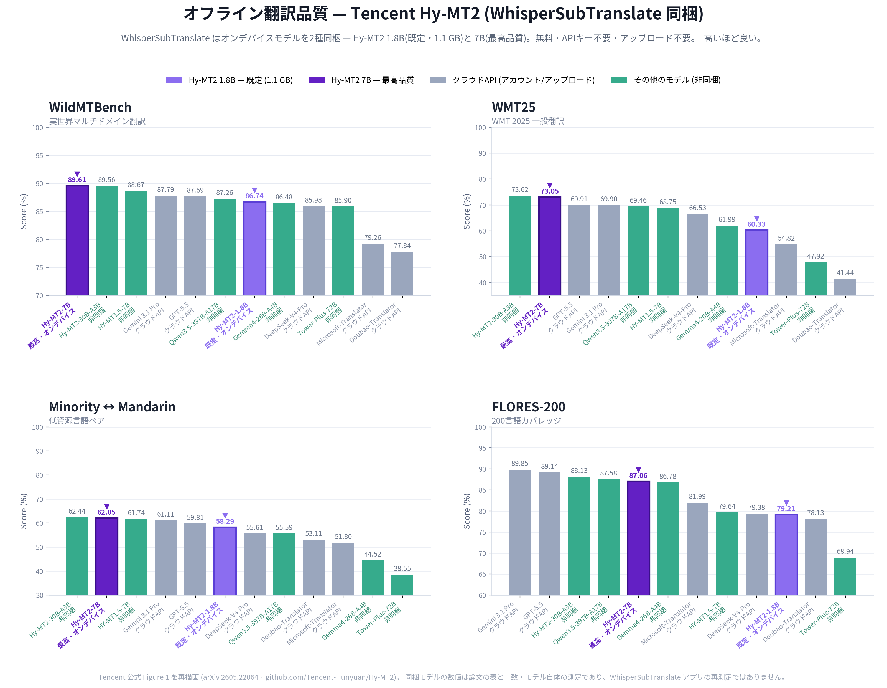

# WhisperSubTranslate

[English](../README.md) | [한국어](./README.ko.md) | 日本語 | [中文](./README.zh.md) | [Polski](./README.pl.md)

動画をローカルで多言語字幕にします。動画を入れると whisper.cpp で SRT を生成し、ダウンロードした Hy-MT2 モデルでオフライン翻訳するか、無料/有料のオンラインエンジンで翻訳します。

> このアプリは動画の音声から新しい字幕を作成します(音声認識)。埋め込み字幕トラックの抽出や画面文字の読み取り(OCR)は行いません。

## プレビュー

<p align="center">
  
</p>

## 主な機能

- 音声認識は 100% ローカルで動作。動画が PC の外に出ず、アカウントもアップロードも不要。
- Hy-MT2 モデルの初回ダウンロード後はオフライン翻訳、または自分のキーでオンラインエンジン(MyMemory, DeepL, OpenAI, Gemini, Claude)を利用。
- モデル自動ダウンロード。Python のインストールや手動設定は不要。
- 通常モデルで同期がずれる動画向けの同期補正モデル(large-v2 同期、同期ライト)を搭載。
- キュー、リアルタイム進捗、ローカル専用の処理履歴。

## はじめに

### ユーザー

[Releases](https://github.com/Blue-B/WhisperSubTranslate/releases) から最新のポータブル版をダウンロードし、展開して `WhisperSubTranslate.exe` を実行します。選択した音声認識モデルのダウンロード後は、字幕抽出が PC 上で完全オフラインで動作します。翻訳は任意です。

### 開発者

```bash
npm ci
npm start
```

- Node.js 22.12.0 以上 (`package.json` の `engines` を参照)。リポジトリのロックファイルを使用します
- 依存関係のインストール時に whisper.cpp も用意されます (Windows は CUDA と Vulkan ビルド)。数 GB 以上の空き容量を確保してください
- FFmpeg は npm で同梱。選択した GGML モデルは初回使用時にダウンロード

アプリケーションコードは `src/main/` (Electron のメインプロセスとサービス)、`src/preload/` (レンダラーブリッジ)、`src/renderer/` (UI)、`src/shared/` (共有 IPC チャンネル)で構成されています。

### Linux

```bash
sudo apt install cmake build-essential git ffmpeg   # Ubuntu/Debian
npm ci   # whisper.cpp をソースからビルド
npm start
```

CUDA 高速化が必要な場合は `npm ci` の前に NVIDIA CUDA Toolkit を入れてください。whisper.cpp の手動ビルド手順は [CONTRIBUTING.md](../CONTRIBUTING.md) にあります。

- **Linux キーリング**: API キーは Electron safeStorage (libsecret) で保存されます。キーリングデーモンがない環境(ヘッドレス SSH セッション、最小構成のデスクトップ/WM)では、ハードコードされたキーを使う従来の AES 方式にフォールバックし、アプリは明示的なセキュリティ警告を記録して保存を `insecure` と表示します。この保存方式は **安全ではありません**。安全な保存を有効にするには `gnome-keyring` をインストールするか、キーリングが動作するデスクトップセッションで実行してください。

### Windows ビルド

```bash
npm run build-win -- --publish never   # 成果物は dist2/ に出力されます
```

通常の Windows 依存関係をインストールするには Windows 上でビルドしてください。Linux からクロスビルドすると、npm が Windows 専用の optional パッケージを省略する場合があります。ビルドワークスペースには、ロックファイルで固定された `@node-llama-cpp/win-x64`、`win-x64-cuda`、`win-x64-cuda-ext`、`win-x64-vulkan` の各パッケージと、その JS/JSON メタデータおよびネイティブバイナリがすべて必要です。ビルドが成功しただけでは、ローカル翻訳のバックエンドが Windows で読み込めることを確認できません。

## 翻訳エンジン

Tencent Hy-MT2 モデルを一度ダウンロードして字幕をオフライン翻訳するか、必要に応じて API キーを使って無料/有料のオンラインエンジンを利用できます。

| エンジン                         | オフライン | API キー | 費用         | 備考                                                                                       |
| -------------------------------- | :--------: | :------: | ------------ | ------------------------------------------------------------------------------------------ |
| Hy-MT2 1.8B (ローカル、既定)     |    はい    |   不要   | 無料         | 約1.13GB、VRAM 2GB / RAM 4GB、オンデバイス                                                 |
| Hy-MT2 7B (ローカル)             |    はい    |   不要   | 無料         | 約6.16GB、VRAM 8GB / RAM 12GB、大型モデル                                                  |
| MyMemory                         |   いいえ   |   不要   | 無料         | 1 日の利用上限あり                                                                         |
| DeepL                            |   いいえ   |   必要   | プランによる | アカウントの現在の API 上限を確認                                                          |
| OpenAI (モデル設定可能)          |   いいえ   |   必要   | 有料         | 設定でモデルを選択または直接入力                                                           |
| Gemini (モデル設定可能)          |   いいえ   |   必要   | モデルによる | アカウントごとの上限あり ([キー取得](https://aistudio.google.com/app/apikey))              |
| Claude (モデル設定可能)          |   いいえ   |   必要   | 有料         | 設定でモデルを選択または直接入力 ([キー取得](https://console.anthropic.com/settings/keys)) |
| カスタム OpenAI 互換プロバイダー |   いいえ   |   必要   | 各種         | 自前エンドポイント (OpenRouter、Ollama、vLLM など)                                         |

ローカル Hy-MT2 翻訳は、モデルのダウンロード後は API キーもネットワーク接続も不要で、使用ごとの費用もかかりません。このエンジンを使う場合、字幕テキストは PC の外に出ません。

Hy-MT2 は固定されたモデルリビジョンからダウンロードされ、インストール前に正確なファイルサイズと SHA-256 ダイジェストが検証されます。既存モデルも読み込み前にハッシュ検証され、アプリのセッション中に変更されていないファイルについては成功した検証結果がキャッシュされます。整合性チェックに失敗しても既存モデルは削除されません。

ローカル翻訳は GPU バックエンドを自動選択します。バックエンドの利用状況に応じて、NVIDIA ハードウェアも CUDA だけでなく Vulkan を使用できます。この選択は whisper.cpp の音声認識とは別で、CPU モードも利用できます。

既定の **1件ずつ翻訳** でも GPU を利用できます。**自動調整** は任意で有効にする試験的機能です。モデル全体を CUDA GPU に配置でき、メモリに余裕がある場合に並列処理を調整します。特に短い処理では、かえって遅くなる場合があります。問題があれば 1件ずつ翻訳を選択してください。復旧可能な並列処理の準備エラーやメモリ不足では、同じ GPU で1件ずつ再試行する案内を表示し、原因を `errors.log` に記録します。デバイス自動選択による CPU での再試行とは別で、成功を保証するものではありません。

### 翻訳品質 (オフラインエンジン)

WhisperSubTranslate は Tencent Hy-MT2 モデル(既定 1.8B、オプション 7B)のダウンロードに対応しています。Tencent の公式評価では、Hy-MT2 ファミリーは主要な商用翻訳 API と競合し、一部のベンチマークでは上回る結果を示しています。



出典: Tencent の公式ベンチマーク: [Hy-MT2 リポジトリ](https://github.com/Tencent-Hunyuan/Hy-MT2), [技術レポート](https://arxiv.org/pdf/2605.22064), [HuggingFace モデル](https://huggingface.co/tencent/Hy-MT2-1.8B)。上のグラフは Tencent 公式 Figure 1 を再描画したもので、対応モデル(1.8B/7B)の数値は論文の表と照合しています。これらの数値は標準的な機械翻訳ベンチマーク(WildMTBench, WMT25, FLORES-200 など)でモデル自体を測定した結果であり、WhisperSubTranslate アプリ自体を再測定したものではありません。

長い動画(1時間以上)では MyMemory の1日制限で遅くなることがあります。その場合は Gemini、DeepL、設定済みの GPT モデルを使ってください。

## 音声認識モデル

モデルは必要に応じて `_models/` にダウンロードされます。NVIDIA は CUDA、Vulkan 対応の他の GPU (AMD, Intel) は Vulkan、どちらも使えない場合は CPU で動作します。GPU に合うサイズを選んでください。

| モデル                | サイズ   | VRAM    | 速度 | 備考                             |
| --------------------- | -------- | ------- | ---- | -------------------------------- |
| tiny                  | 約75MB   | 約1GB   | 最速 | 基本                             |
| base                  | 約142MB  | 約1GB   | 高速 | 良好                             |
| small                 | 約466MB  | 約1GB   | 中速 | より良い                         |
| medium                | 約1.5GB  | 約2GB   | 中速 | 優秀                             |
| large-v3              | 約3GB    | 約4GB   | 低速 | 文字起こし最高                   |
| large-v3-turbo (既定) | 約1.62GB | 約2GB   | 高速 | 総合的に最も無難                 |
| large-v2 同期         | 約4.4GB  | 約4.5GB | 低速 | 別エンジン、字幕同期を補正       |
| large-v2 同期ライト   | 共用     | 約3GB   | 低速 | 同期と同じファイル、int8、低VRAM |

同期と同期ライトは別の Faster-Whisper エンジン(初回に一度自動ダウンロード; エンジン アーカイブ約1.4GB + モデルファイル約3GB、合計約4.4GB)を使い、同じモデルファイルを共有するため、一度ダウンロードすれば両方使えます。通常モデルで同期がずれるときだけ使ってください。非英語の動画(日本語、韓国語、中国語)で最も正確で、英語は通常 large-v3-turbo で十分です。

サイズと必要メモリは目安です。実際の RAM/VRAM 使用量はバックエンド、モデル、設定によって異なり、ダウンロードサイズとは一致しません。

## 言語サポート

- UI: 韓国語、英語、日本語、中国語、ポーランド語
- 翻訳対象(15言語): ko, en, ja, zh, es, fr, de, it, pt, ru, hu, ar, pl, tr, fa
- 音声認識: whisper.cpp で100言語以上

## データ保存

設定、モデルファイル、ログ、処理履歴はローカルに保存されます。オンライン翻訳では字幕テキストを選択したサービスに送信しますが、ローカル Hy-MT2 翻訳では送信しません。

| データ          | 場所                                                                                                                                                          |
| --------------- | ------------------------------------------------------------------------------------------------------------------------------------------------------------- |
| 設定と API キー | `%APPDATA%\whispersubtranslate\translation-config-safe.json`                                                                                                  |
| 処理履歴        | `%APPDATA%\whispersubtranslate\history.json` (最大200件)                                                                                                      |
| エラーログ      | `%APPDATA%\whispersubtranslate\logs\errors.log`                                                                                                               |
| モデル          | `%APPDATA%\whispersubtranslate\_models` (ユーザーデータフォルダ; 非ASCII Windows アカウントは `C:\Users\Public\WhisperSubTranslate\_models` にフォールバック) |

ローカル翻訳モデルは `%APPDATA%\whispersubtranslate\hy-mt-models` に保存されます。上記は Windows の既定のパスで、ポータブルモードではユーザーデータフォルダーが変わります。

設定の診断情報コピーには API キー、パス、字幕本文を含みません。エラーログの場所を開くボタンは、ポータブルモードを含めた実際の保存先を表示します。ログがまだない場合は空のファイルを作らず、フォルダーのみを開きます。ログを共有する前に、個人情報を含むパスや内容がないか確認してください。

API キーは利用可能な場合に OS のセキュア保存を使います (上記 Linux キーリングの注意事項を参照)。設定ファイルを Git や配布物に含めないでください。処理履歴は任意で(設定で切替)、最大200件まで保持されます。

### ポータブルデータレイアウト

既定ではモデル・キャッシュ・設定は `%APPDATA%`(システム SSD)に保存されます。USB/外付けドライブにまとめて置きたい場合は、実行ファイルの隣に `portable-data/` フォルダを作るか(または `WHISPER_PORTABLE_DATA` 環境変数をフォルダパスに設定)、アプリは `userData` をそこへリダイレクトします。

## 貢献

Pull Request を歓迎します。ブランチ命名、コミット規約、手動テストチェックリスト、
whisper.cpp の手動ビルドは [CONTRIBUTING.md](../CONTRIBUTING.md) を参照してください。
UI 言語または翻訳対象の追加は [翻訳ガイド](./TRANSLATION.md) を参照してください。

[Weblate](https://hosted.weblate.org/engage/whispersubtranslate/) でアプリ UI の
翻訳に参加できます。UI 翻訳文字列は [`locales/*.json`](../locales/) にあります。

## 貢献者

WhisperSubTranslate をより良くしてくれるすべての方に感謝します。

<a href="https://github.com/Blue-B"></a>
<a href="https://github.com/matbgn"></a>
<a href="https://github.com/AtillaTahak"></a>

## 支援

このプロジェクトが時間の節約になったら、支援はバグ修正やモデルの安定化、新しい翻訳オプションの開発に直接役立ちます。

[](https://github.com/sponsors/Blue-B) [](https://buymeacoffee.com/beckycode7h) [](https://www.paypal.com/ncp/payment/ZEWFKDX595ESJ)

## 謝辞

- whisper.cpp: Georgi Gerganov [ggml-org/whisper.cpp](https://github.com/ggml-org/whisper.cpp)
- Hy-MT2: Tencent [Tencent-Hunyuan/Hy-MT2](https://github.com/Tencent-Hunyuan/Hy-MT2)
- FFmpeg: [ffmpeg.org](https://ffmpeg.org/)
- Faster-Whisper-XXL: [Purfview/whisper-standalone-win](https://github.com/Purfview/whisper-standalone-win)
- Silero VAD、`deepl-node`、`node-llama-cpp`、`axios` などの npm 依存関係

バンドル/ダウンロードされるコンポーネントの完全な一覧とライセンスは [THIRD_PARTY_NOTICES.md](../THIRD_PARTY_NOTICES.md) を参照してください。

## ライセンス

GPL-3.0。外部 API とサービス(DeepL, OpenAI, Gemini など)は各自の規約に従います。
