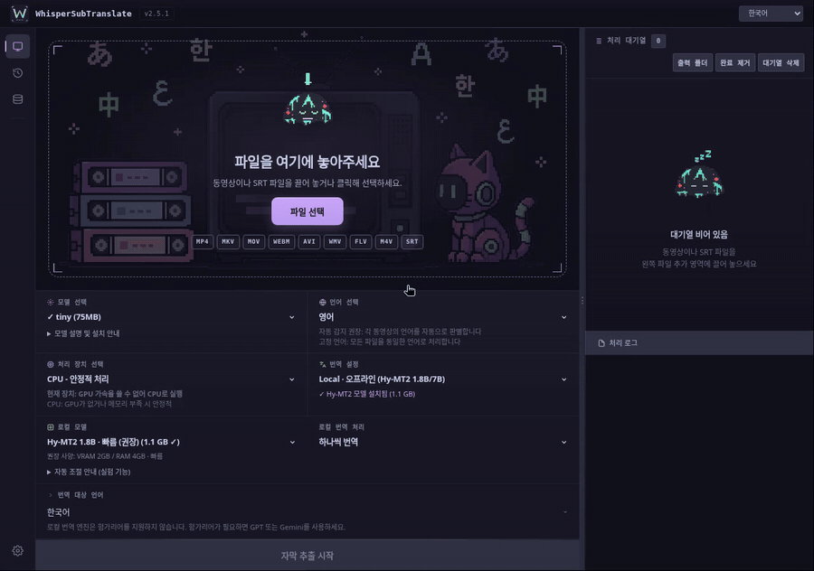
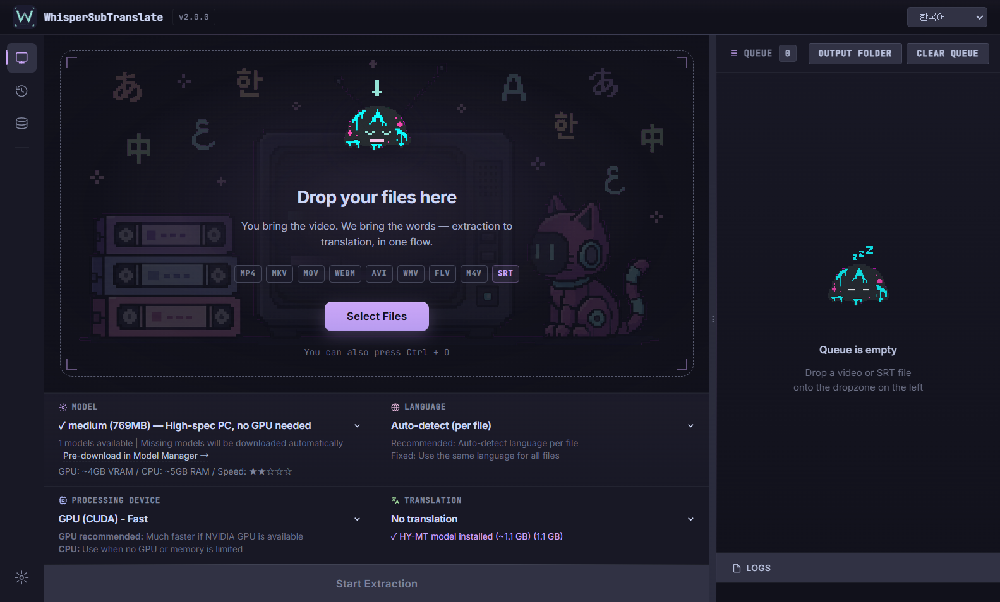
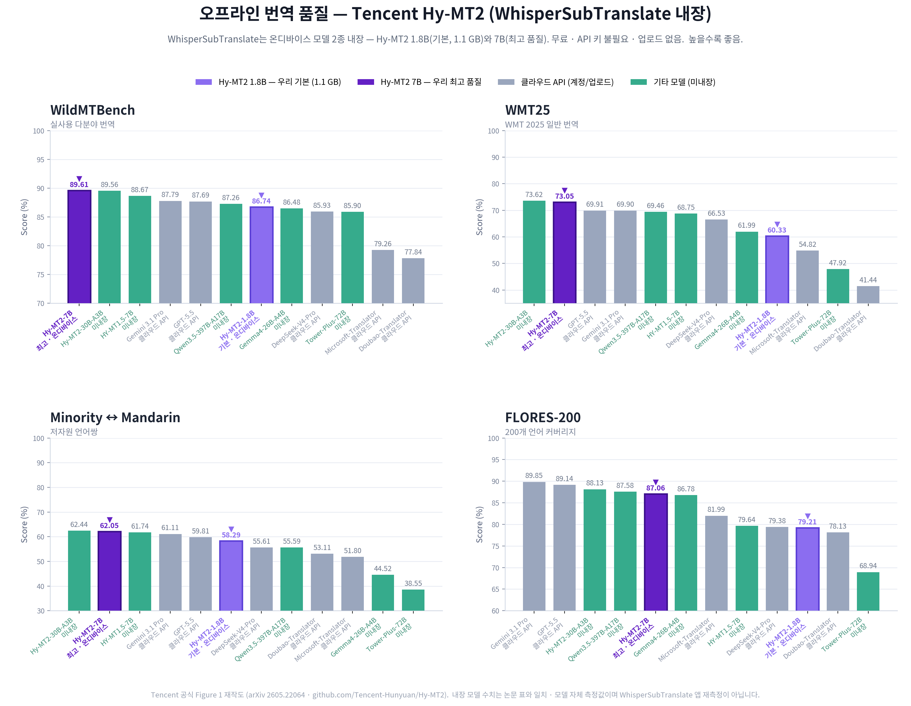

# WhisperSubTranslate

[English](../README.md) | 한국어 | [日本語](./README.ja.md) | [中文](./README.zh.md) | [Polski](./README.pl.md)

영상을 내 PC에서 다국어 자막으로 만듭니다. 영상을 넣으면 whisper.cpp로 SRT를 생성하고, 다운로드한 Hy-MT2 모델로 오프라인 번역하거나 무료/유료 온라인 엔진으로 번역합니다.

> 이 앱은 영상의 음성을 받아써서 새 자막을 만듭니다. 영상에 들어 있는 자막 트랙을 추출하거나 화면의 글자를 읽지 않습니다(OCR 아님).

## 미리보기

[](../assets/demo/demo-30s.ko.mp4)

[30초 MP4 보기 / 다운로드](../assets/demo/demo-30s.ko.mp4). 한국어 UI에서 실제 영상 자막 추출과 로컬 번역을 실행한 모습입니다. [촬영 조건](DEMO_RECORDING.md#한국어).

<details>
<summary>정적 앱 스크린샷</summary>



</details>

## 주요 기능

- 음성 인식이 100% 로컬에서 돌아갑니다. 영상이 PC를 벗어나지 않고 계정도 업로드도 없습니다.
- Hy-MT2 모델을 처음 다운로드한 뒤 오프라인으로 번역하거나, 본인 키로 온라인 엔진(MyMemory, DeepL, OpenAI, Gemini, Claude)을 씁니다.
- 모델 자동 다운로드. 파이썬 설치나 수동 설정이 필요 없습니다.
- 일반 모델로 싱크가 밀릴 때 쓰는 싱크 교정 모델(large-v2 싱크, 싱크 라이트)을 제공합니다.
- 작업 큐, 실시간 진행률, 로컬 전용 작업 히스토리.

## 시작하기

### 사용자

**[Windows x64 ZIP 다운로드 · v2.5.1 · 2.15 GB](https://github.com/Blue-B/WhisperSubTranslate/releases/download/v2.5.1/WhisperSubTranslate-v2.5.1-win-x64.zip)** · [변경 사항 / 최신 버전](https://github.com/Blue-B/WhisperSubTranslate/releases/latest)

GitHub의 “Source code”가 아닌 `WhisperSubTranslate-v2.5.1-win-x64.zip`을 받으세요. 이 Windows 배포본은 Python이나 CUDA Toolkit을 별도로 설치할 필요가 없습니다. Linux 사용자는 아래 소스 실행 안내를 따라 주세요.

1. **새 폴더에 ZIP 전체를 압축 해제**한 뒤 그 안의 `WhisperSubTranslate.exe`를 실행합니다. ZIP 안에서 바로 실행하거나 EXE만 다른 폴더로 옮기지 마세요.
2. 처음에는 말소리가 또렷한 짧은 영상(약 10~30초)을 추가합니다. **번역 → 번역 안함**, 영상의 음성 언어(또는 자동 감지), **처리 장치 → 자동**을 선택하세요. 기본 음성 모델은 `large-v3-turbo`입니다. 설치 확인만 빨리 해보려면 다운로드가 작은 `tiny`/`base`를 쓸 수 있지만 정확도는 낮습니다.
3. **자막 추출 시작**을 누릅니다. 선택한 모델의 다운로드 확인창이 나오면 확인하고, 완료될 때까지 인터넷 연결을 유지하세요. 모델은 처음 한 번 받으며, 다운로드 시간과 실제 자막 추출 시간은 별개입니다.
4. 완료 후 **출력 폴더 열기**로 `.srt`를 확인합니다. 기본 저장 위치는 원본 영상 옆이며, 같은 이름의 파일이 있으면 새 이름으로 저장합니다. 동영상 플레이어에서 몇 줄의 내용과 싱크를 확인하세요.
5. 번역하려면 **Hy-MT2(로컬)**와 번역할 언어를 선택해 다시 시작하거나, 기존 SRT를 추가합니다. 번역 모델은 처음 쓸 때 별도로 받습니다. 필요한 모델을 받은 뒤에는 API 키 없이 로컬 추출·번역을 오프라인으로 쓸 수 있습니다.

#### 다운로드 용량과 디스크 공간

Windows ZIP과 AI 모델은 **별도 다운로드**입니다. v2.5.1 기준 대략적인 다운로드 용량(10진 단위):

| 다운로드 항목 | 추가 다운로드 용량 | 필요한 때 |
| --- | ---: | --- |
| Windows x64 포터블 ZIP | 2.15 GB | 앱 버전별 1회 |
| 기본 음성 모델 `large-v3-turbo` | 1.62 GB | 해당 모델로 처음 추출할 때 |
| 음성 모델 `tiny` / `base` | 77.7 MB / 148 MB | 작은 모델로 설치를 확인할 때, 선택 사항 |
| Hy-MT2 1.8B 번역 모델 | 1.13 GB | 로컬 번역을 쓸 때만 |
| Hy-MT2 7B 번역 모델 | 6.16 GB | 더 큰 로컬 번역 모델을 선택할 때 |

ZIP + 기본 음성 모델은 **인터넷 다운로드 약 3.77 GB**, Hy-MT2 1.8B까지 받으면 **약 4.90 GB**입니다. 이 합계가 필요한 여유 디스크 공간은 아닙니다. 압축을 풀 때는 ZIP과 압축 해제된 앱을 함께 저장할 공간이 필요하고, 처리 중에는 임시 오디오·결과 파일·다운로드 여유 공간도 필요합니다. 압축 해제된 Windows 앱 용량은 여기서 실측하지 않았으므로 정확한 전체 디스크 요구량은 제시하지 않습니다. 싱크 모델은 엔진·모델을 추가로 받습니다. [음성 인식 모델](#음성-인식-모델)을 참고하세요.

EXE를 다른 드라이브에 두어도 모델은 기본적으로 시스템 드라이브의 `%APPDATA%\whispersubtranslate` 아래에 저장됩니다. 앱과 데이터를 함께 보관하려면 **처음 실행하기 전에** EXE 옆에 `portable-data` 폴더를 만드세요. [포터블 데이터 저장](#포터블-데이터-구성) 안내도 참고하세요.

첫 작업이 오래 걸리면 로그에서 **모델 다운로드**, **자막 추출**, **번역** 중 어느 단계인지 먼저 확인하세요. 로컬 번역만 느리다면 로그의 실제 백엔드를 확인하고 **설정 → 진단 정보 복사**를 사용하세요. 음성 인식과 번역은 가속 방식을 각각 선택하므로, NVIDIA GPU가 있다는 사실만으로 번역이 CUDA에서 실행됐다고 볼 수는 없습니다.

### 개발자

```bash
npm ci
npm start
```

- Node.js 22.12.0 이상 (`package.json`의 `engines` 참고). 저장소의 잠금 파일을 사용합니다
- 의존성 설치 시 whisper.cpp도 준비합니다 (Windows는 CUDA와 Vulkan 빌드). 디스크 공간을 수 GB 이상 확보하세요
- FFmpeg는 npm으로 포함되며, 선택한 GGML 모델은 처음 쓸 때 받습니다

애플리케이션 코드는 `src/main/`(Electron 메인 프로세스와 서비스), `src/preload/`(렌더러 브리지), `src/renderer/`(UI), `src/shared/`(공용 IPC 채널)로 구성됩니다.

### Linux

```bash
sudo apt install cmake build-essential git ffmpeg   # Ubuntu/Debian
npm ci   # whisper.cpp를 소스에서 빌드
npm start
```

CUDA 가속이 필요하면 `npm ci` 전에 NVIDIA CUDA Toolkit을 설치하세요. whisper.cpp 수동 빌드 방법은 [CONTRIBUTING.md](../CONTRIBUTING.md)에 있습니다.

- **Linux 키링**: API 키는 Electron safeStorage(libsecret)로 저장됩니다. 키링 데몬이 없는 환경(헤드리스 SSH 세션, 최소 데스크톱/WM)에서는 하드코딩된 키를 쓰는 기존 AES 방식으로 폴백되며, 앱은 명시적인 보안 경고를 기록하고 저장을 `insecure`로 표시합니다. 이 저장 방식은 **안전하지 않습니다**. 안전한 저장을 사용하려면 `gnome-keyring`을 설치하거나 키링이 실행되는 데스크톱 세션에서 앱을 실행하세요.

### Windows 빌드

```bash
npm run build-win -- --publish never   # 결과물은 dist2/에 생성됩니다
```

일반적인 Windows 의존성 설치를 위해서는 Windows에서 빌드하세요. Linux에서 교차 빌드하면 npm이 Windows 전용 선택적 패키지를 생략할 수 있습니다. 빌드 작업 공간에는 잠금 파일에 고정된 `@node-llama-cpp/win-x64`, `win-x64-cuda`, `win-x64-cuda-ext`, `win-x64-vulkan` 패키지와 각 패키지의 JS/JSON 메타데이터 및 네이티브 바이너리가 모두 있어야 합니다. 빌드 성공만으로는 로컬 번역 백엔드가 Windows에서 로드된다는 사실을 확인할 수 없습니다.

## 번역 엔진

Tencent Hy-MT2 모델을 한 번 다운로드해 자막을 오프라인으로 번역하거나, 필요한 경우 API 키를 사용해 무료/유료 온라인 엔진을 씁니다.

| 엔진                      | 오프라인 | API 키 | 비용          | 비고                                                                                       |
| ------------------------- | :------: | :----: | ------------- | ------------------------------------------------------------------------------------------ |
| Hy-MT2 1.8B (로컬, 기본)  |    예    | 불필요 | 무료          | 약 1.13GB, VRAM 2GB / RAM 4GB, 온디바이스                                                  |
| Hy-MT2 7B (로컬)          |    예    | 불필요 | 무료          | 약 6.16GB, VRAM 8GB / RAM 12GB, 더 큰 모델                                                 |
| MyMemory                  |  아니오  | 불필요 | 무료          | 일일 사용 한도 적용                                                                        |
| DeepL                     |  아니오  |  필요  | 요금제별 상이 | 계정의 현재 API 한도 확인                                                                  |
| OpenAI (모델 설정 가능)   |  아니오  |  필요  | 유료          | 설정에서 모델 선택 또는 직접 입력                                                          |
| Gemini (모델 설정 가능)   |  아니오  |  필요  | 모델별 상이   | 계정별 한도 적용 ([키 받기](https://aistudio.google.com/app/apikey))                       |
| Claude (모델 설정 가능)   |  아니오  |  필요  | 유료          | 설정에서 모델 선택 또는 직접 입력 ([키 받기](https://console.anthropic.com/settings/keys)) |
| 커스텀 OpenAI 호환 공급자 |  아니오  |  필요  | 상이          | 자체 엔드포인트 사용 (OpenRouter, Ollama, vLLM 등)                                         |

로컬 Hy-MT2 번역은 모델 다운로드 후 API 키나 네트워크 연결이 필요 없고, 사용당 비용도 없습니다. 이 엔진을 사용하면 자막 텍스트가 PC를 벗어나지 않습니다.

Hy-MT2는 고정된 모델 리비전에서 다운로드되며, 설치 전에 정확한 파일 크기와 SHA-256 다이제스트를 확인합니다. 기존 모델도 로드 전에 해시를 확인하고, 앱 세션 중 변경되지 않은 파일은 성공한 검사 결과를 캐시합니다. 무결성 검사에 실패해도 기존 모델을 삭제하지 않습니다.

로컬 번역은 GPU 백엔드를 자동으로 선택합니다. 백엔드 가용성에 따라 NVIDIA 하드웨어도 CUDA뿐 아니라 Vulkan을 사용할 수 있습니다. 이 선택은 whisper.cpp 음성 인식과 별개이며, CPU 모드도 사용할 수 있습니다.

기본값인 **하나씩 번역**도 GPU를 사용할 수 있습니다. **자동 조절**은 직접 켜서 사용하는 실험 기능으로, 모델 전체가 CUDA GPU에 올라가고 메모리가 충분할 때 병렬 처리를 조절합니다. 특히 짧은 작업은 오히려 느려질 수 있습니다. 문제가 있으면 하나씩 번역을 선택하세요. 복구 가능한 병렬 준비 실패나 메모리 부족이 발생하면 같은 GPU에서 하나씩 재시도한다는 안내를 표시하고, 원인은 `errors.log`에 남깁니다. 장치 자동 선택의 CPU 재시도와는 별개이며, 재시도 성공을 보장하지는 않습니다.

### 번역 품질 (오프라인 엔진)

WhisperSubTranslate는 Tencent Hy-MT2 모델(기본 1.8B, 선택 7B) 다운로드를 지원합니다. Tencent 공식 평가에서 Hy-MT2 계열은 주요 상용 번역 API와 경쟁력 있는 결과를 보였고, 일부 벤치마크에서는 앞선 결과도 냈습니다.



출처: Tencent 공식 벤치마크: [Hy-MT2 저장소](https://github.com/Tencent-Hunyuan/Hy-MT2), [기술 보고서](https://arxiv.org/pdf/2605.22064), [HuggingFace 모델](https://huggingface.co/tencent/Hy-MT2-1.8B). 위 그래프는 Tencent 공식 Figure 1을 재작도한 것이며, 지원 모델(1.8B/7B) 수치는 논문 표와 대조했습니다. 이 수치는 표준 기계번역 벤치마크(WildMTBench, WMT25, FLORES-200 등)에서 모델 자체를 측정한 결과이며, WhisperSubTranslate 앱 자체를 재측정한 것은 아닙니다.

긴 영상(1시간 이상)에서는 MyMemory 일일 한도 때문에 느려질 수 있습니다. 그럴 때는 Gemini, DeepL, 설정한 GPT 모델을 쓰세요.

## 음성 인식 모델

모델은 필요할 때 `_models/`로 받아집니다. NVIDIA는 CUDA, Vulkan을 지원하는 다른 GPU(AMD, Intel)는 Vulkan, 둘 다 안 되면 CPU로 돌아갑니다. GPU에 맞는 크기를 고르세요.

| 모델                  | 크기      | VRAM     | 속도      | 비고                           |
| --------------------- | --------- | -------- | --------- | ------------------------------ |
| tiny                  | 약 75MB   | 약 1GB   | 가장 빠름 | 기본                           |
| base                  | 약 142MB  | 약 1GB   | 빠름      | 양호                           |
| small                 | 약 466MB  | 약 1GB   | 보통      | 더 좋음                        |
| medium                | 약 1.5GB  | 약 2GB   | 보통      | 우수                           |
| large-v3              | 약 3GB    | 약 4GB   | 느림      | 받아쓰기 최고                  |
| large-v3-turbo (기본) | 약 1.62GB | 약 2GB   | 빠름      | 전반적으로 가장 무난           |
| large-v2 싱크         | 약 4.4GB  | 약 4.5GB | 느림      | 별도 엔진, 자막 싱크 교정      |
| large-v2 싱크 라이트  | 공용      | 약 3GB   | 느림      | 싱크와 같은 파일, int8, 저VRAM |

싱크와 싱크 라이트는 별도 Faster-Whisper 엔진(한 번 자동 다운로드; 엔진 아카이브 약 1.4GB + 모델 파일 약 3GB, 합계 약 4.4GB)을 쓰고 같은 모델 파일을 공유해서, 한 번 받으면 둘 다 쓸 수 있습니다. 일반 모델로 싱크가 밀릴 때만 쓰세요. 비영어 영상(일본어, 한국어, 중국어)에서 가장 정확하고, 영어는 보통 large-v3-turbo로 충분합니다.

크기와 메모리 요구량은 대략적인 값입니다. 실제 RAM과 VRAM 사용량은 백엔드, 모델과 설정에 따라 달라지며, 다운로드 크기와 실행 중 메모리 사용량은 다릅니다.

## 언어 지원

- UI: 한국어, 영어, 일본어, 중국어, 폴란드어
- 번역 대상(15개): ko, en, ja, zh, es, fr, de, it, pt, ru, hu, ar, pl, tr, fa
- 음성 인식: whisper.cpp로 100개 이상 언어

## 데이터 저장

설정, 모델 파일, 로그와 작업 이력은 로컬에 저장합니다. 온라인 번역을 사용하면 자막 텍스트를 선택한 서비스로 보내며, 로컬 Hy-MT2 번역은 보내지 않습니다.

| 데이터         | 위치                                                                                                                                      |
| -------------- | ----------------------------------------------------------------------------------------------------------------------------------------- |
| 설정 및 API 키 | `%APPDATA%\whispersubtranslate\translation-config-safe.json`                                                                              |
| 작업 히스토리  | `%APPDATA%\whispersubtranslate\history.json` (최대 200개)                                                                                 |
| 에러 로그      | `%APPDATA%\whispersubtranslate\logs\errors.log`                                                                                           |
| 모델           | `%APPDATA%\whispersubtranslate\_models` (사용자 데이터 폴더; 비ASCII Windows 계정은 `C:\Users\Public\WhisperSubTranslate\_models`로 폴백) |

로컬 번역 모델은 `%APPDATA%\whispersubtranslate\hy-mt-models`에 저장합니다. 위 경로는 Windows 기본값이며, 포터블 모드에서는 사용자 데이터 폴더가 달라집니다.

설정의 **진단 정보 복사**는 API 키, 경로와 자막 내용을 제외합니다. **오류 로그 위치 열기**는 포터블 모드를 포함한 실제 로그 위치를 보여 줍니다. 오류 로그가 없으면 빈 파일을 만들지 않고 폴더만 엽니다. 원본 로그를 공유하기 전에는 개인 경로나 내용이 들어 있는지 확인하세요.

API 키는 사용 가능한 경우 OS 보안 저장소를 이용합니다 (위 Linux 키링 주의사항 참고). 설정 파일을 Git에 올리거나 배포물에 포함하지 마세요. 작업 히스토리는 선택이고(설정에서 토글) 최대 200개까지 보관됩니다.

### 포터블 데이터 구성

기본적으로 모델, 캐시와 설정은 `%APPDATA%`(시스템 SSD)에 저장됩니다. USB나 외장 드라이브에 모두 두고 싶다면 실행 파일 옆에 `portable-data/` 폴더를 만들거나(또는 `WHISPER_PORTABLE_DATA` 환경 변수를 폴더 경로로 설정) 앱이 `userData`를 그곳으로 리다이렉션합니다.

## 기여

Pull Request를 환영합니다. 브랜치 네이밍, 커밋 규칙, 수동 테스트 체크리스트,
whisper.cpp 수동 빌드는 [CONTRIBUTING.md](../CONTRIBUTING.md)를 보세요.
UI 언어나 번역 대상 추가는 [번역 가이드](./TRANSLATION.md)를 참고하세요.

[Weblate](https://hosted.weblate.org/engage/whispersubtranslate/)에서 앱 UI
번역에 참여할 수 있습니다. UI 번역 문자열은
[`locales/*.json`](../locales/)에 있습니다.

## 기여자

WhisperSubTranslate를 함께 만들어주는 모든 분께 감사합니다.

<a href="https://github.com/Blue-B"></a>
<a href="https://github.com/matbgn"></a>
<a href="https://github.com/AtillaTahak"></a>

## 후원

이 프로젝트가 시간을 아껴줬다면, 후원은 버그 수정과 모델 안정화, 새 번역 옵션 작업에 직접 도움이 됩니다.

[](https://github.com/sponsors/Blue-B) [](https://buymeacoffee.com/beckycode7h) [](https://www.paypal.com/ncp/payment/ZEWFKDX595ESJ)

## 감사의 말

- whisper.cpp: Georgi Gerganov [ggml-org/whisper.cpp](https://github.com/ggml-org/whisper.cpp)
- Hy-MT2: Tencent [Tencent-Hunyuan/Hy-MT2](https://github.com/Tencent-Hunyuan/Hy-MT2)
- FFmpeg: [ffmpeg.org](https://ffmpeg.org/)
- Faster-Whisper-XXL: [Purfview/whisper-standalone-win](https://github.com/Purfview/whisper-standalone-win)
- Silero VAD, `deepl-node`, `node-llama-cpp`, `axios` 등 npm 의존성

번들/다운로드 구성요소 전체 목록과 라이선스는 [THIRD_PARTY_NOTICES.md](../THIRD_PARTY_NOTICES.md)를 보세요.

## 라이선스

GPL-3.0. 외부 API와 서비스(DeepL, OpenAI, Gemini 등)는 각자의 약관을 따릅니다.
