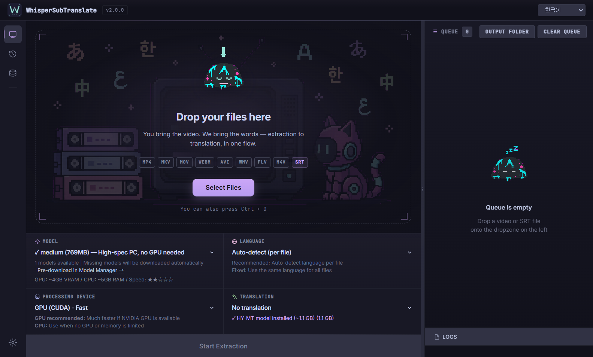

# WhisperSubTranslate

[English](../README.md) | [한국어](./README.ko.md) | [日本語](./README.ja.md) | 中文 | [Polski](./README.pl.md)

将视频音频转成 SRT 字幕，并翻译到目标语言的 Windows 桌面应用。提取使用 whisper.cpp 快速稳定处理，翻译可选择 **本地模型（Hy-MT2 1.8B/7B GGUF，完全离线）** 或在线引擎（MyMemory 免费、DeepL、GPT-5-nano/OpenAI、Gemini）。

> 重要：本应用使用 whisper.cpp 从视频音频新生成 SRT 字幕；不会提取已有的内嵌字幕轨道，也不会识别屏幕文字（无 OCR）。

## 预览



## 为什么选择 WhisperSubTranslate

字幕提取100%本地处理，视频不会离开你的电脑。无需注册账户，无需信用卡。离线生成高质量 SRT；翻译也可选择 **本地模型（Hy-MT2 GGUF）** 实现100%离线，或使用在线引擎（免费 MyMemory、自己的 DeepL/OpenAI/Gemini 密钥）。

### 价值一览

| 需求         | 你得到什么                   |
| ------------ | ---------------------------- |
| 隐私与掌控   | 100% 本地 STT，无需上传云端  |
| 零门槛       | 无账号、无信用卡、无个人信息 |
| 无使用上限   | 应用本身不设日/月限制        |
| 看懂外语视频 | 一次生成抽取+翻译 SRT        |
| 少折腾       | 模型自动下载，无需 Python    |
| 清晰反馈     | 队列、平滑进度、ETA          |

> 注：使用在线翻译引擎时，服务方可能有配额（如 MyMemory）。应用本身不设置使用上限。

## 快速开始

### 用户：运行便携版

- 从 Releases 下载最新便携版压缩包：`WhisperSubTranslate-v2.1.0-win-x64.zip`
- 解压后运行 `WhisperSubTranslate.exe`

即可使用。提取在本机完全离线运行。翻译是可选的（本地 Hy-MT2 模型可实现100%离线翻译，或使用免费 MyMemory 以及自己的 DeepL/OpenAI/Gemini API 密钥）。

### 开发者：从源码运行

```bash
npm install
npm start
```

- **whisper-cpp** 在 `npm install` 时自动下载（Windows: ~700MB CUDA 版本）
- 在 **Linux/macOS** 上，如果没有预构建二进制文件，将自动从源码构建（需要 `cmake`、`gcc`/`clang`、`git`）
- **FFmpeg** 通过 npm 包自动包含
- 首次运行如缺少选定的 GGML 模型，会自动下载至 `_models/`

> 自动下载失败时，请从 [whisper.cpp releases](https://github.com/ggml-org/whisper.cpp/releases) 手动下载并解压到 `whisper-cpp/` 文件夹。

### Linux 安装

WhisperSubTranslate 在 Linux 上只需几个额外步骤即可运行：

**必需软件包：**

```bash
# Ubuntu/Debian
sudo apt install cmake build-essential git ffmpeg

# CUDA GPU 加速（可选，需要 NVIDIA GPU + 驱动程序）
# 安装 CUDA Toolkit: https://developer.nvidia.com/cuda-downloads
```

**从源码运行：**

```bash
git clone https://github.com/Blue-B/WhisperSubTranslate.git
cd WhisperSubTranslate
npm install    # whisper.cpp 将自动从源码构建
npm start
```

如果自动构建失败，请手动构建 whisper.cpp：

```bash
git clone https://github.com/ggml-org/whisper.cpp
cd whisper.cpp

# 仅 CPU
cmake -B build && cmake --build build --config Release

# 使用 CUDA（NVIDIA GPU）
cmake -B build -DGGML_CUDA=ON && cmake --build build --config Release

# 复制二进制文件
cp build/bin/whisper-cli /path/to/WhisperSubTranslate/whisper-cpp/
```

### 构建（Windows）

```bash
npm run build-win
```

生成在 `dist2/` 目录。

## 技术栈

[](https://www.electronjs.org/) [](https://nodejs.org/) [](https://developer.mozilla.org/docs/Web/JavaScript) [](https://www.deepl.com/zh/pro-api) [](https://platform.openai.com/)

| 项目         | 说明                                                                                          |
| ------------ | --------------------------------------------------------------------------------------------- |
| 运行时       | Electron、Node.js、JavaScript                                                                 |
| 打包         | electron-builder                                                                              |
| 网络         | axios                                                                                         |
| 语音→文本    | whisper.cpp (GGML 模型)                                                                       |
| 翻译（可选） | 本地（Hy-MT2 1.8B/7B GGUF，node-llama-cpp）、DeepL API、OpenAI（GPT-5-nano）、Gemini、MyMemory |

## 翻译引擎

| 引擎                 | 费用           | 密钥       | 限制 / 说明                                                                                       |
| -------------------- | -------------- | ---------- | ------------------------------------------------------------------------------------------------- |
| **本地 Hy-MT2 1.8B**  | **免费/离线**  | **不需要** | **约 1.13GB 模型，VRAM 2GB / RAM 4GB，快速**                                                      |
| **本地 Hy-MT2 7B**    | **免费/离线**  | **不需要** | **约 6.16GB 模型，VRAM 8GB / RAM 12GB，高质量**                                                     |
| MyMemory             | 免费           | 不需要     | 每 IP 约 5 万字/日                                                                                |
| DeepL                | 每月 50 万免费 | 需要       | 有付费档                                                                                          |
| GPT-5-nano（OpenAI） | 付费           | 需要       | 输入 $0.05 / 输出 $0.40 per 1M tokens                                                             |
| Gemini 3 Flash       | 免费/付费      | 需要       | 免费: 每日250字幕/20-30分钟，付费: 无限制 ([获取API密钥](https://aistudio.google.com/app/apikey)) |

> **提示**: 1小时以上的长视频可能会触发MyMemory的日限额，建议使用Gemini或DeepL。

API密钥和设置保存在用户PC的 `app.getPath('userData')` 路径下，使用基本编码进行存储。即使在文件管理器中误打开，也不会以明文形式显示，并且绝不会包含在Git或发布文件中。

### 数据存储位置

| 数据               | 位置                                                                |
| ------------------ | ------------------------------------------------------------------- |
| 设置 & API 密钥    | `%APPDATA%\whispersubtranslate\translation-config-encrypted.json`   |
| 错误日志 (Windows) | `%APPDATA%\whispersubtranslate\logs\errors.log`                     |
| 错误日志 (macOS)   | `~/Library/Application Support/whispersubtranslate/logs/errors.log` |
| 错误日志 (Linux)   | `~/.config/whispersubtranslate/logs/errors.log`                     |
| 作业历史           | `%APPDATA%\whispersubtranslate\history.json`（最多保留200条）       |
| 模型               | `_models/`（应用文件夹内）                                          |

### 作业历史

- 每个完成的作业自动记录 — **最多200条**。
- 每行提供**打开**（播放结果文件）和**文件夹**（在资源管理器中打开）按钮。
- 在**设置 → 历史**中随时开关。关闭后仅停止新记录，现有数据保留。
- **全部清除**时文件被零覆盖后删除，以及旧的 localStorage 残留数据被 padding 压缩。由于 SSD wear leveling 特性，仅靠软件无法保证100%不可恢复 — 需要严格保证请使用全盘加密。

### 模型下载安全性

- 下载期间卡片上会显示**取消**按钮，随时可以中断。
- 下载期间关闭窗口也会安全中断。
- Whisper GGML 文件被接收到 `.partial` 临时文件，**仅在完成时**重命名为 `ggml-*.bin` — 部分下载的文件绝不会被误认为“已安装”。

## 语言支持

### UI 语言

韩语、英语、日语、中文、波兰语（5种语言）

### 翻译目标语言（14种）

韩语 (ko)、英语 (en)、日语 (ja)、中文 (zh)、西班牙语 (es)、法语 (fr)、德语 (de)、意大利语 (it)、葡萄牙语 (pt)、俄语 (ru)、匈牙利语 (hu)、阿拉伯语 (ar)、波兰语 (pl)、**波斯语 (fa)**

### 音频识别语言

whisper.cpp 支持100多种语言，包括所有主要世界语言（英语、西班牙语、法语、德语、意大利语、葡萄牙语、俄语、中文、日语、韩语、阿拉伯语、印地语、土耳其语等）。

## 模型与性能

模型存储在 `_models/`，按需自动下载。模型越大越慢，但可能更准确。CUDA 可用时使用 GPU，否则使用 CPU。

| 模型              | 大小   | VRAM | 速度 | 质量 |
| ----------------- | ------ | ---- | ---- | ---- |
| tiny              | ~75MB  | ~1GB | 最快 | 基本 |
| base              | ~142MB | ~1GB | 快   | 良好 |
| small             | ~466MB | ~2GB | 中等 | 更好 |
| medium            | ~1.5GB | ~4GB | 慢   | 优秀 |
| large-v3          | ~3GB   | ~5GB | 最慢 | 最佳 |
| large-v3-turbo ⭐ | ~809MB | ~4GB | 快   | 卓越 |

> 注：VRAM 需求基于 [whisper.cpp](https://github.com/ggerganov/whisper.cpp) 的 GGML 优化，比 PyTorch Whisper（large 约 10GB）低很多。已测试：6GB VRAM GPU 可运行 large-v3。

## 分支策略

单一主干：`main` 作为唯一的长期分支，维护者直接在 `main` 上提交和打标签（如 `v2.0.0`）。

**外部贡献者**请从 fork 创建 Pull Request。推荐使用 `feature/<scope>` 格式的短生命分支，以 squash 合并方式合入 `main`。

## 贡献

> **想添加新语言？** 请参阅[翻译指南](TRANSLATION.md)。

### 1) 分支/命名

将所有修改（功能/修复/文档）统一为一种分支类型：

| 模式                     | 用途     |
| ------------------------ | -------- |
| `feature/<scope>-<desc>` | 所有改动 |

建议的 <scope> 列表：i18n, ui, translation, whisper, model, download, queue, progress, ipc, main, renderer, updater, config, build, logging, perf, docs, readme

示例：

```text
feature/i18n-api-modal
feature/ui-progress-smoothing
feature/translation-deepl-test
feature/main-disable-devtools
```

### 2) 提交规范（Conventional Commits）

使用 `feat:`, `fix:`, `docs:`, `refactor:`, `chore:`, `perf:`, `build:` 等前缀。

```text
feat: add DeepL connection test
fix: localize target language note
```

### 3) 代码规范（I18N）

| 主题      | 规范                                                |
| --------- | --------------------------------------------------- |
| I18N      | UI/日志文案不要写在代码里，放入 I18N 表并通过键引用 |
| 体验      | 保持进度/ETA/队列一致性，避免回归                   |
| 范围      | 小步、聚焦的修改，函数命名清晰                      |
| 多语言 UI | 新 UI 需同步更新 ko/en/ja/zh/pl                     |

### 4) 手动测试清单

| 场景      | 核对                                       |
| --------- | ------------------------------------------ |
| 仅提取    | 启停流程，进度/ETA 表现                    |
| 提取+翻译 | 端到端结果及最终 SRT 命名                  |
| 模型下载  | 缺失模型自动下载，下载中取消/停止          |
| I18N 切换 | 目标语言标签/弹窗文案即时更新              |
| 翻译引擎  | MyMemory（无密钥）、DeepL/OpenAI（有密钥） |
| 构建      | `npm run build-win` 完成                   |

### 5) PR 清单

| 项目    | 要求                               |
| ------- | ---------------------------------- |
| 说明    | 清晰描述变更                       |
| UI 影响 | 提供界面变更截图                   |
| 测试    | 说明复现/验证步骤                  |
| 资源    | 禁止大体积二进制；截图放 `assets/` |

## 支持

如果这个项目帮你省时间或产出更好的字幕，支持将直接加速开发。

- 用途：修复缺陷、提升模型下载稳定性、打磨 UI、扩展翻译选项、Windows 构建/测试
- 透明：不出售数据；资金用于开发时间、发布构建的基础设施、翻译 API 的测试费用
- 一次性支持也会在 README/发布说明的赞助者名单中署名（可选择不公开）
- 月度支持（$3/mo，GitHub Sponsors 自动扣款）额外享受 "Sponsor Request" issue 的优先分流（best-effort）

[](https://github.com/sponsors/Blue-B) [](https://buymeacoffee.com/beckycode7h)

## 致谢

- whisper.cpp 由 Georgi Gerganov 开发: [ggml-org/whisper.cpp](https://github.com/ggml-org/whisper.cpp)
- FFmpeg: [ffmpeg.org](https://ffmpeg.org/)

## 贡献者

感谢每一位让 WhisperSubTranslate 变得更好的人！🙏

<a href="https://github.com/Blue-B"></a>
<a href="https://github.com/matbgn"></a>

## 仓库活动


## 翻译

欢迎参与 WhisperSubTranslate 的翻译！可翻译字符串位于 [`locales/*.json`](../locales/)，由 [Weblate](https://hosted.weblate.org/engage/whispersubtranslate/) 管理。请参阅 [翻译指南](TRANSLATION.md)。

<a href="https://hosted.weblate.org/engage/whispersubtranslate/">
  
</a>

## Star 历史

<a href="https://star-history.com/#Blue-B/WhisperSubTranslate&Date">
  
</a>

## 许可证

GPL-3.0。使用外部服务（DeepL、OpenAI 等）时请遵守其各自条款。
