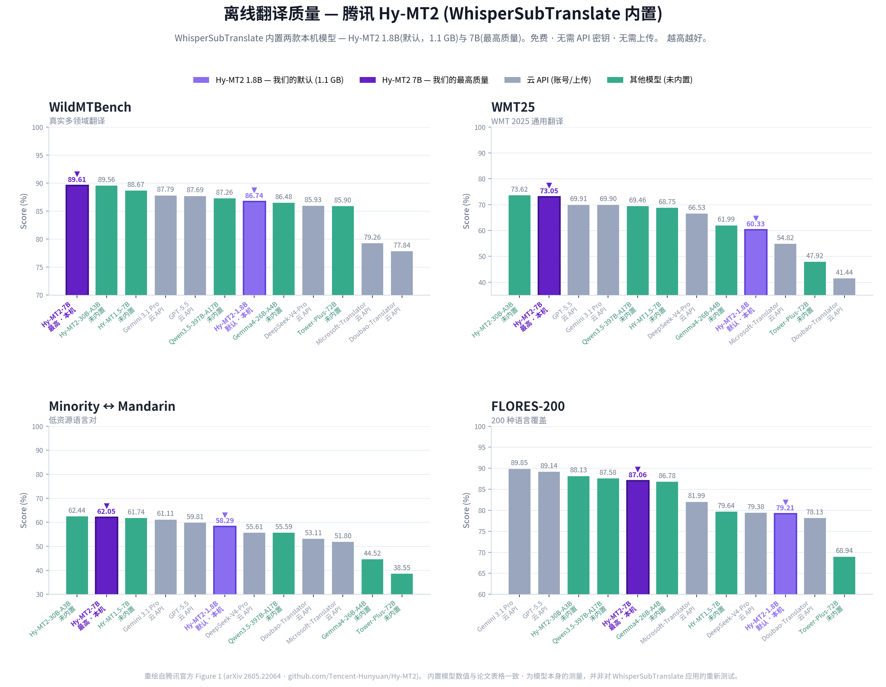

# WhisperSubTranslate

[English](../README.md) | [한국어](./README.ko.md) | [日本語](./README.ja.md) | 中文 | [Polski](./README.pl.md)

在本地把视频变成多语言字幕。放入视频，用 whisper.cpp 生成 SRT，再用下载的 Hy-MT2 模型离线翻译，或使用免费/付费的在线引擎。

> 本应用从视频音频生成新字幕(语音转文字)。不提取内嵌字幕轨道，也不读取画面文字(非 OCR)。

## 预览

<p align="center">
  
</p>

## 主要功能

- 语音识别 100% 在本地运行。视频不离开你的电脑，无需账号，无需上传。
- 首次下载 Hy-MT2 模型后可离线翻译，或用自己的密钥使用在线引擎(MyMemory、DeepL、OpenAI、Gemini、Claude)。
- 模型自动下载。无需安装 Python，无需手动配置。
- 提供同步修复模型(large-v2 同步、同步轻量),用于普通模型字幕错位的视频。
- 任务队列、实时进度、仅本地的任务历史。

## 快速开始

### 用户

从 [Releases](https://github.com/Blue-B/WhisperSubTranslate/releases) 下载最新便携版，解压后运行 `WhisperSubTranslate.exe`。所选语音模型下载完成后，字幕提取可在本机完全离线运行。翻译为可选。

### 开发者

```bash
npm ci
npm start
```

- Node.js 22.12.0 或更高版本 (参见 `package.json` 中的 `engines`)，使用仓库中的锁文件
- 安装依赖时也会准备 whisper.cpp (Windows 为 CUDA 和 Vulkan 版本)，请预留数 GB 以上的磁盘空间
- FFmpeg 通过 npm 自带；所选 GGML 模型在首次使用时下载

应用代码位于 `src/main/` (Electron 主进程和服务)、`src/preload/` (渲染器桥接)、`src/renderer/` (UI)和 `src/shared/` (共享 IPC 通道)。

### Linux

```bash
sudo apt install cmake build-essential git ffmpeg   # Ubuntu/Debian
npm ci   # whisper.cpp 从源码构建
npm start
```

如需 CUDA 加速，请在 `npm ci` 前安装 NVIDIA CUDA Toolkit。whisper.cpp 的手动构建步骤见 [CONTRIBUTING.md](../CONTRIBUTING.md)。

- **Linux 密钥环**: API 密钥通过 Electron safeStorage (libsecret) 保存。没有密钥环守护进程时(无头 SSH 会话、最小桌面/WM)，保存会回退到使用硬编码密钥的旧版 AES，应用会记录明确的安全警告，并将该保存标记为 `insecure`。这种存储方式**并不安全**。请安装 `gnome-keyring`，或在运行密钥环的桌面会话中使用应用，以启用安全存储。

### Windows 构建

```bash
npm run build-win -- --publish never   # 产物输出到 dist2/
```

请在 Windows 上构建，以正常安装 Windows 依赖项。从 Linux 交叉构建时，npm 可能省略仅限 Windows 的可选包。构建工作区必须包含锁文件固定版本的 `@node-llama-cpp/win-x64`、`win-x64-cuda`、`win-x64-cuda-ext` 和 `win-x64-vulkan` 包，包括各自的 JS/JSON 元数据和原生二进制文件。仅构建成功并不能证明本地翻译后端能在 Windows 上加载。

## 翻译引擎

下载一次 Tencent Hy-MT2 模型即可离线翻译字幕，也可使用免费/付费在线引擎(适用时需要 API 密钥)。

| 引擎                     | 离线 | API 密钥 | 费用       | 备注                                                                                 |
| ------------------------ | :--: | :------: | ---------- | ------------------------------------------------------------------------------------ |
| Hy-MT2 1.8B (本地，默认) |  是  |  不需要  | 免费       | 约1.13GB，显存 2GB / 内存 4GB，端侧                                                  |
| Hy-MT2 7B (本地)         |  是  |  不需要  | 免费       | 约6.16GB，显存 8GB / 内存 12GB，更大模型                                             |
| MyMemory                 |  否  |  不需要  | 免费       | 有每日用量限制                                                                       |
| DeepL                    |  否  |   需要   | 因套餐而异 | 请查看账户当前的 API 限额                                                            |
| OpenAI (模型可配置)      |  否  |   需要   | 付费       | 在设置中选择或直接输入模型                                                           |
| Gemini (模型可配置)      |  否  |   需要   | 因模型而异 | 受账户用量限制 ([获取密钥](https://aistudio.google.com/app/apikey))                  |
| Claude (模型可配置)      |  否  |   需要   | 付费       | 在设置中选择或直接输入模型 ([获取密钥](https://console.anthropic.com/settings/keys)) |
| 自定义 OpenAI 兼容提供商 |  否  |   需要   | 各异       | 自带端点 (OpenRouter、Ollama、vLLM 等)                                               |

本地 Hy-MT2 翻译在模型下载完成后无需 API 密钥或网络连接，也没有按次使用费用。使用此引擎时，字幕文本不会离开你的电脑。

Hy-MT2 从固定的模型修订版本下载，并在安装前核对准确的文件大小和 SHA-256 摘要。现有模型也会在加载前接受哈希校验；应用会在当前会话中缓存未更改文件的成功校验结果。完整性校验失败不会删除现有模型。

本地翻译会自动选择 GPU 后端。视后端可用情况而定，NVIDIA 硬件除 CUDA 外也可使用 Vulkan。此选择独立于 whisper.cpp 语音识别，CPU 模式也可用。

默认的**逐条翻译**也可以使用 GPU。**自动调整**是需要主动启用的实验功能，在模型完全加载到 CUDA GPU 且内存充足时调整并行处理。它可能更慢，尤其是短任务。遇到问题时请选择逐条翻译。出现可恢复的并行准备错误或内存不足时，会提示在同一 GPU 上逐条重试，并将原因写入 `errors.log`。这与设备自动选择时的 CPU 重试不同，也不保证重试成功。

### 翻译质量 (离线引擎)

WhisperSubTranslate 支持下载 Tencent Hy-MT2 模型(默认 1.8B，可选 7B)。在 Tencent 官方评测中，Hy-MT2 系列与主流商用翻译 API 具备竞争力，并在部分基准上取得领先结果。



来源: Tencent 官方基准: [Hy-MT2 仓库](https://github.com/Tencent-Hunyuan/Hy-MT2), [技术报告](https://arxiv.org/pdf/2605.22064), [HuggingFace 模型](https://huggingface.co/tencent/Hy-MT2-1.8B)。上图重绘自 Tencent 官方 Figure 1，支持的模型(1.8B/7B)数值已与论文表格核对。这些数据是在标准机器翻译基准(WildMTBench, WMT25, FLORES-200 等)上对模型本身的测量，并非对 WhisperSubTranslate 应用本身的重新基准测试。

对于长视频(1小时以上),MyMemory 的每日限制可能导致变慢。这时请改用 Gemini、DeepL 或已配置的 GPT 模型。

## 语音识别模型

模型按需下载到 `_models/`。NVIDIA 使用 CUDA，其他支持 Vulkan 的 GPU (AMD、Intel) 使用 Vulkan，都不可用时回退到 CPU。请选择适合你 GPU 的大小。

| 模型                  | 大小     | 显存    | 速度 | 备注                         |
| --------------------- | -------- | ------- | ---- | ---------------------------- |
| tiny                  | 约75MB   | 约1GB   | 最快 | 基础                         |
| base                  | 约142MB  | 约1GB   | 快   | 良好                         |
| small                 | 约466MB  | 约1GB   | 中等 | 更好                         |
| medium                | 约1.5GB  | 约2GB   | 中等 | 优秀                         |
| large-v3              | 约3GB    | 约4GB   | 慢   | 转写最佳                     |
| large-v3-turbo (默认) | 约1.62GB | 约2GB   | 快   | 综合最均衡                   |
| large-v2 同步         | 约4.4GB  | 约4.5GB | 慢   | 独立引擎，修复字幕同步       |
| large-v2 同步轻量     | 共用     | 约3GB   | 慢   | 与同步同一文件，int8，低显存 |

同步与同步轻量使用独立的 Faster-Whisper 引擎(首次自动下载一次; 引擎压缩包约1.4GB + 模型文件约3GB，合计约4.4GB),并共用同一模型文件，所以下载一次即可两者通用。仅在普通模型字幕错位时使用。它们在非英语视频(日语、韩语、中文)上最准确，英语通常用 large-v3-turbo 即可。

大小和内存需求均为估计值。实际 RAM/显存占用取决于后端、模型及设置，下载大小不等于运行时内存占用。

## 语言支持

- 界面: 韩语、英语、日语、中文、波兰语
- 翻译目标(15种): ko, en, ja, zh, es, fr, de, it, pt, ru, hu, ar, pl, tr, fa
- 语音识别: whisper.cpp 支持100多种语言

## 数据存储

设置、模型文件、日志和任务历史保存在本地。在线翻译会将字幕文本发送给所选服务，本地 Hy-MT2 翻译则不会。

| 数据            | 位置                                                                                                                                   |
| --------------- | -------------------------------------------------------------------------------------------------------------------------------------- |
| 设置与 API 密钥 | `%APPDATA%\whispersubtranslate\translation-config-safe.json`                                                                           |
| 任务历史        | `%APPDATA%\whispersubtranslate\history.json` (最多200条)                                                                               |
| 错误日志        | `%APPDATA%\whispersubtranslate\logs\errors.log`                                                                                        |
| 模型            | `%APPDATA%\whispersubtranslate\_models` (用户数据文件夹; 非 ASCII 的 Windows 账户回退到 `C:\Users\Public\WhisperSubTranslate\_models`) |

本地翻译模型保存在 `%APPDATA%\whispersubtranslate\hy-mt-models`。以上是 Windows 默认路径，便携模式会更改用户数据文件夹。

设置中的诊断信息复制不包含 API 密钥、路径或字幕内容。打开错误日志位置的按钮会显示实际保存位置，包括便携模式的路径。尚无日志时只打开文件夹，不创建空文件。分享原始日志前，请检查其中是否含有私人路径或内容。

API 密钥在可用时使用操作系统安全存储 (见上方 Linux 密钥环提示)。请勿将配置文件提交到 Git 或打包到发行文件中。任务历史为可选(在设置中开关),最多保留200条。

### 便携数据布局

默认情况下，模型、缓存和设置位于 `%APPDATA%`(系统 SSD)。若想全部放在 U 盘/外置驱动器上，请在可执行文件旁创建 `portable-data/` 文件夹(或设置 `WHISPER_PORTABLE_DATA` 环境变量为文件夹路径)，应用就会把 `userData` 重定向到那里。

## 贡献

欢迎 Pull Request。分支命名、提交规范、手动测试清单、whisper.cpp 手动构建见
[CONTRIBUTING.md](../CONTRIBUTING.md)。添加界面语言或翻译目标请参阅
[翻译指南](./TRANSLATION.md)。

可在 [Weblate](https://hosted.weblate.org/engage/whispersubtranslate/)
参与应用界面翻译。界面翻译字符串位于 [`locales/*.json`](../locales/)。

## 贡献者

感谢所有让 WhisperSubTranslate 变得更好的人。

<a href="https://github.com/Blue-B"></a>
<a href="https://github.com/matbgn"></a>
<a href="https://github.com/AtillaTahak"></a>

## 支持

如果本项目为你节省了时间，直接支持有助于修复 bug、提升模型可靠性和增加新的翻译选项。

[](https://github.com/sponsors/Blue-B) [](https://buymeacoffee.com/beckycode7h) [](https://www.paypal.com/ncp/payment/ZEWFKDX595ESJ)

## 致谢

- whisper.cpp: Georgi Gerganov [ggml-org/whisper.cpp](https://github.com/ggml-org/whisper.cpp)
- Hy-MT2: Tencent [Tencent-Hunyuan/Hy-MT2](https://github.com/Tencent-Hunyuan/Hy-MT2)
- FFmpeg: [ffmpeg.org](https://ffmpeg.org/)
- Faster-Whisper-XXL: [Purfview/whisper-standalone-win](https://github.com/Purfview/whisper-standalone-win)
- Silero VAD、`deepl-node`、`node-llama-cpp`、`axios` 等 npm 依赖

捆绑/下载组件的完整列表及许可请参阅 [THIRD_PARTY_NOTICES.md](../THIRD_PARTY_NOTICES.md)。

## 许可证

GPL-3.0。外部 API 与服务(DeepL、OpenAI、Gemini 等)需遵守各自条款。
